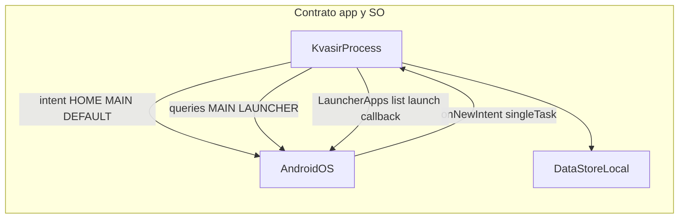

# Dominio (as-designed)

Contexto para agentes. **No es spec:** no autoriza código. El repo es greenfield; esto describe el producto acordado, no un sistema existente.

## Qué es Kvasir

Launcher nativo Android (Kotlin + Jetpack Compose) de uso personal y APK libre. Sustituye el Home. Posicionamiento: hiperfocus — poca RAM residente, vuelta a Home instantánea, cero sobrecarga. El minimalismo es interno, no solo visual.

**Para quién:** un usuario, un teléfono, un proceso Home. Sin cuentas, sync ni red.

**Qué no es:** launcher full-featured, habit-tracker con historial, tema de iconos, producto de Play Store. v1 no busca, no agrupa, no personaliza por app, no muestra iconos.

Nombre visible en el picker de Inicio: **Kvasir** (el `applicationId` se fija en spec `001`).

## Actor

| Actor | Rol |
| --- | --- |
| Usuario | Persona única en su dispositivo. Elige Kvasir como app de Inicio, marca favoritas, cumple hábitos del día, abre el overlay A–Z para el resto de apps. |

No hay multi-usuario, work profile ni perfiles en v1.

## Conceptos

| Concepto | Qué es | Persistencia |
| --- | --- | --- |
| `InstalledApp` | App lanzable: `ComponentName` + `label` (`String`). Sin iconos/`Bitmap` en v1. | Memoria (`LauncherApps`). No disco. |
| `FavoriteApp` | Subconjunto de `InstalledApp` que el usuario quiere en Home. Clave: `componentKey`. | DataStore (`StringSet`). |
| `Habit` | Ítem diario editable: `id` + `label`. | DataStore (JSON vía `org.json` del SDK). |
| `HabitDayState` | `epochDay` + ids cumplidos hoy. Al cambiar el día, los checks se resetean. | DataStore. |
| `ThemeMode` | Claro u oscuro. Compose-only; no recrea la Activity. | DataStore. |
| `ScrubberState` | Letra seleccionada y pointer. Overlay de **todas** las apps lanzables. | Efímero. No se persiste. |

## Superficies v1

- **Home:** reloj/fecha (Composable aislado, tick 1 Hz), lista de favoritas en texto (tap = lanzar), sección de hábitos del día (check). Sin iconos, sin grilla.
- **Overlay scrubber:** escape hatch A–Z de todas las apps lanzables. Tap lanza; no añade favorita. Creación perezosa.
- **Ajustes:** alta/baja de favoritas, alta/baja/renombrar hábitos, toggle claro/oscuro.
- **Vacíos:** sin favoritas; letra sin apps; primer arranque si Kvasir aún no es la app de Inicio.

v2 (no implementar): búsqueda, gestos extra, per-app theming, carpetas, iconos, rachas/historial, widgets, wallpaper, badges, work profile, atajos, i18n.

## Paths canónicos (propuestos)

El proyecto Android **aún no existe**. Spec `001` lo crea. Paquete Java propuesto: `app.kvasir.launcher`.

```
app/src/main/java/app/kvasir/launcher/
  KvasirApp.kt
  MainActivity.kt
  di/AppContainer.kt
  ui/home/
  ui/overlay/
  ui/habits/
  ui/settings/
  ui/theme/
  domain/model/
  domain/usecase/
  data/apps/LauncherAppsRepository.kt
  data/prefs/PreferencesRepository.kt
```

`@Composable` no llama a `LauncherApps` ni `PackageManager`. Flujo: data → dominio → ViewModel → UI.

## Contrato con Android

Un solo cliente, sin red. Las fronteras de contrato son el SO y DataStore local.



- **Ser Home:** `MAIN` + `HOME` + `DEFAULT`. `launchMode=singleTask`, `clearTaskOnLaunch=true`, `stateNotNeeded=true`, `resumeOnTaskLaunch=true`. La Activity no hace `finish()` con Back; se consume back (y predictive back). `onNewIntent` es el camino caliente a Home.
- **Listar y lanzar:** `LauncherApps` (`getActivityList`, `startMainActivity`, `Callback`). PackageManager/`queryIntentActivities` es detalle interno, no API de UI.
- **Visibilidad (API 30+):** `<queries>` con `MAIN`/`LAUNCHER`. **No** `QUERY_ALL_PACKAGES`.
- **Permisos v1:** ninguno peligroso. Sin `INTERNET`, accesibilidad ni overlay de sistema.

## Stack acordado

- `minSdk 26`, `compileSdk`/`targetSdk 36`.
- ViewModel + StateFlow + `collectAsStateWithLifecycle`.
- DI manual (`AppContainer`). No Hilt ni Koin.
- DataStore Preferences + `org.json` del SDK. No Room en v1.
- Compose BOM, Lifecycle, Activity Compose, DataStore. Cualquier otra librería exige justificación en la spec.

## Presupuesto de rendimiento

Medido en gama media, Home caliente, overlay cerrado, tema cargado:

- RAM residente (RSS) idle: **< 80 MB**.
- Volver a Home (`onNewIntent`, proceso vivo): **< 100 ms** percibidos.
- Cold start → primer frame: **< 400 ms**.
- Scrubber en arrastre: **60 fps**, p95 de frame **< 16 ms**.
- Reloj: **1 Hz**, aislado; no recomponer favoritas ni hábitos.
- Overlay: perezoso; al cerrar, soltar pointer; **cero bitmaps** de iconos en v1.
- APK debug (sin extras): alarma si se dispara por encima de ~**5 MB** al añadir deps.

Toda spec que toque el proceso Home declara impacto contra este presupuesto. Si lo degrada, no entra.

## Flujos críticos

1. **Arranque como Home** — proceso nace, Activity `singleTask`, primer frame con reloj; favoritas/hábitos/tema desde DataStore.
2. **Volver a Home** — `onNewIntent`; no recrear el árbol entero; overlay cerrado.
3. **Abrir overlay** — gesto desde Home; lista de `InstalledApp` ya en memoria.
4. **Filtrar por letra** — `ScrubberState.selectedLetter`; mostrar labels que arrancan por esa letra.
5. **Lanzar app** — ViewModel → repositorio → `LauncherApps.startMainActivity`.
6. **Marcar hábito** — toggle id en `HabitDayState`; si `epochDay` ≠ hoy, reset primero.
7. **Cambiar tema** — escribir DataStore; `MaterialTheme` recompone; **prohibido** `AppCompatDelegate.setDefaultNightMode` en v1.

## No tocar sin spec

- Manifest HOME / `singleTask` / back / `onNewIntent`.
- `<queries>`, permisos, intents del SO.
- Esquema DataStore y migraciones.
- Presupuesto de RAM / recomposición / arranque.
- Añadir dependencias.
- Recrear la Activity por tema.
