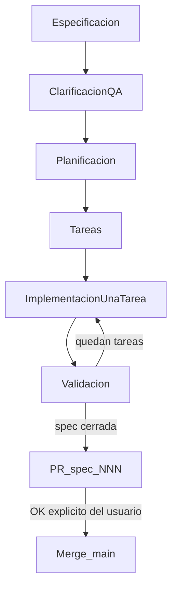

# Flujo SDD

Spec-Driven Development para Kvasir: un solo cliente Android, sin backend, sin API de red. La frontera de contrato es el SO Android y el esquema DataStore local.

## Fases

| Fase | Quién | Entrega | Parar cuando |
| --- | --- | --- | --- |
| Especificación | Agente + usuario (PLAN) | `specs/NNN-slug/spec.md` (QUÉ/POR QUÉ, EARS en español) | Usuario aprueba la spec |
| Clarificación QA | Agente | Preguntas de una en una si cambian diseño o contrato | Máx. 4; detalles menores → `[NECESITA ACLARACIÓN]` |
| Planificación | Agente (PLAN) | `plan.md` (CÓMO: archivos, decisión + alternativa descartada) | Usuario aprueba el plan |
| Tareas | Agente | `tasks.md` | Usuario aprueba el recorte |
| Implementación | Agente | **Una** tarea del recorte, luego parar | La tarea está hecha y validada |
| Validación | Agente | Tests o checklist de cada RF tocado | Spec cerrada → PR; merge a `main` solo con OK explícito |

## Spec = QUÉ / POR QUÉ

Plantilla: `specs/_templates/spec.md`.

- Requisitos en EARS (español).
- Copy de UI en español.
- **Sin** checkboxes de múltiples clientes ni versionado de API: no existen aquí.

Extra obligatorio en **cada** spec:

1. **Impacto en rendimiento** — si toca el proceso Home: RAM residente, recomposiciones, arranque a Home, contra el presupuesto de `docs/domain.md`. Si no toca Home, declararlo.
2. **Persistencia** — si toca DataStore: cambio de esquema, migración y compatibilidad con instalaciones previas. Si no, declararlo.
3. **Contrato con Android** — si toca Manifest, permisos, `<queries>` o intents: decirlo explícitamente. Si no, declararlo.
4. **Dependencias** — prohibido añadir librería sin justificación peso vs beneficio. Default = no añadir.

## Plan = CÓMO

Plantilla: `specs/_templates/plan.md`.

- Archivos/estructura Kotlin/Compose reales (paths canónicos de `docs/domain.md`).
- Cada decisión técnica: recomendación + alternativa descartada y por qué.
- No implementar en la fase de plan.

## Tareas e implementación

Plantilla: `specs/_templates/tasks.md`.

- Una spec = una rama `spec/NNN-slug` = un PR.
- Implementar **una** tarea, parar, validar. No encadenar el recorte entero sin confirmación.
- Citar `NNN` y RF en código y tests (comentario breve o nombre de test).

## Tests

Cada RF mapea a: prueba unitaria (JVM), instrumentada (solo si aporta), o checklist manual verificable. No reescribir tests de paso. Instrumented no corre en CI por defecto.

## Qué no es SDD aquí

- No hay superficies compartidas ni contrato de red.
- No hay «RF de compatibilidad de API».
- El andamiaje SDD no incluye el proyecto Android; eso es spec `001`.

## Skill y regla

- Skill: `.cursor/skills/sdd/SKILL.md`
- Regla persistente: `.cursor/rules/sdd-workflow.mdc`
- Entrada para agentes: `AGENTS.md`
