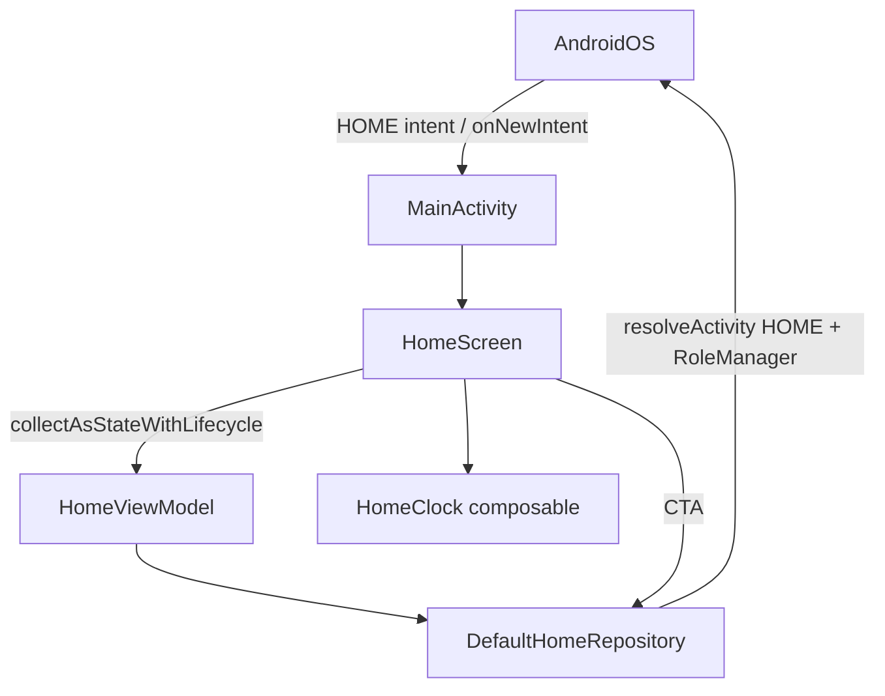

# Plan 001 — Esqueleto Home

**Spec:** `specs/001-home-skeleton/spec.md`  
**Estado:** aprobado  
**Rama:** `spec/001-home-skeleton`

## Enfoque

Nacer el módulo `app` greenfield: una `ComponentActivity` Compose declarada como HOME, DI manual vacío-pero-listo, Home con reloj aislado + empty state + CTA «Elegir como Inicio» alimentado por un repositorio de datos (no desde Composables). Sin DataStore, sin `LauncherApps`, sin overlay.

## Archivos

### Gradle / proyecto (crear)

- `settings.gradle.kts` — módulo `:app`
- `build.gradle.kts` — plugins root (Android + Kotlin, apply false)
- `gradle.properties`
- `gradle/libs.versions.toml` — versiones centralizadas
- `gradlew` + wrapper
- `app/build.gradle.kts` — `applicationId`, SDKs, deps de la spec
- `app/src/main/AndroidManifest.xml`
- `app/proguard-rules.pro` — mínimo (placeholder)

### Kotlin — paquete `app.kvasir.launcher` (crear)

- `app/src/main/java/app/kvasir/launcher/KvasirApp.kt`
- `app/src/main/java/app/kvasir/launcher/MainActivity.kt`
- `app/src/main/java/app/kvasir/launcher/di/AppContainer.kt`
- `app/src/main/java/app/kvasir/launcher/data/home/DefaultHomeRepository.kt`
- `app/src/main/java/app/kvasir/launcher/ui/home/HomeViewModel.kt`
- `app/src/main/java/app/kvasir/launcher/ui/home/HomeScreen.kt`
- `app/src/main/java/app/kvasir/launcher/ui/home/HomeClock.kt`
- `app/src/main/java/app/kvasir/launcher/ui/theme/Theme.kt` — Material 3 default / sistema, sin persistencia

### Resources (crear)

- `app/src/main/res/values/strings.xml` — copy ES de la spec
- `app/src/main/res/values/themes.xml` — tema edge-to-edge mínimo sin AppCompat DayNight
- Icono launcher por defecto del template (mipmap); sin set custom

### Tests (crear)

- `app/src/test/java/app/kvasir/launcher/ui/home/ClockFormatTest.kt` — formateo hora/fecha puro (RF-001-06)

### No crear en 001

`data/apps/`, `data/prefs/`, `ui/overlay/`, `ui/habits/`, `ui/settings/`, Navigation, DataStore.

## Decisiones

1. **Scaffold Gradle** — Version Catalog (`libs.versions.toml`) + AGP 8.x + Kotlin 2.0 + JDK 17. **Descartado:** Groovy scripts y versiones sueltas en cada `build.gradle` (más ruido para un repo SDD).
2. **Activity base** — `ComponentActivity` + `activity-compose`. **Descartado:** `AppCompatActivity` (arrastra DayNight / riesgo de `setDefaultNightMode`).
3. **¿Soy el Home default?** — `DefaultHomeRepository` con `packageContext` de `Application`: resuelve el Activity que atiende `ACTION_MAIN` + `CATEGORY_HOME` y compara `packageName` con el nuestro. **Descartado:** llamar `PackageManager` desde `@Composable` (rompe RF-001-10). **Descartado:** `RoleManager.isRoleHeld` solo (no cubre todos los OEMs como única fuente; se usa como refuerzo en API 29+ si aporta; la fuente de verdad es `resolveActivity`).
4. **CTA «Elegir como Inicio»** — En API 29+: `RoleManager.createRequestRoleIntent(ROLE_HOME)`. Si no disponible o falla: `Settings.ACTION_HOME_SETTINGS`. **Descartado:** fijar default por APIs de device-admin / políticas. **Descartado:** solo un `ACTION_MAIN`/`CATEGORY_HOME` chooser genérico (en muchos OEMs no cambia el default).
5. **Releer rol (RF-001-09)** — `HomeViewModel` escucha `Lifecycle.Event.ON_RESUME` (vía callback desde Activity/`LifecycleOwner` del Home) y vuelve a preguntar al repo. **Descartado:** poll periódico (desperdicia CPU en proceso eterno). **Descartado:** `ProcessLifecycleOwner` (demasiado amplio para este caso).
6. **Back** — `OnBackPressedCallback(enabled=true)` vacío (consume) + Manifest `android:enableOnBackInvokedCallback="true"`. **Descartado:** `finish()` / mover a back stack.
7. **`onNewIntent`** — `MainActivity` override: `setIntent(intent)`; no recrear `setContent`. Con `singleTask` el sistema entrega aquí. **Descartado:** `singleTop` (menos idiomático para launchers HOME).
8. **Reloj** — `HomeClock` Composable propio: `LaunchedEffect` + `delay(1000)` + estado local; formateo con locale del dispositivo. Función pura de formato testeable en JVM. **Descartado:** tick en el ViewModel (recompondría suscriptores del resto de Home si el estado vive en el mismo `UiState`).
9. **DI** — `KvasirApp` crea `AppContainer(applicationContext)`; `MainActivity` lo lee y fabrica el `HomeViewModel` con factory simple. Contenedor expone `defaultHomeRepository`. **Descartado:** Hilt.
10. **Tema** — `KvasirTheme` Material 3 con `isSystemInDarkTheme()`; sin persistir. **Descartado:** `AppCompatDelegate.setDefaultNightMode`.

## Rendimiento

- Árbol Compose mínimo: `HomeScreen` = columna con `HomeClock` + empty + CTA condicional.
- Solo `HomeClock` se invalida a 1 Hz; `showDefaultHomeCta: Boolean` en ViewModel no cambia con el tick.
- Sin iconos/`Bitmap`, sin lista de apps, sin DataStore I/O en arranque.
- `DefaultHomeRepository` no cachea `Activity`/`Context` UI: solo `Application` context.
- Metas: RSS idle < 80 MB; cold start < 400 ms; `onNewIntent` < 100 ms percibidos; APK debug sin deps de más (~5 MB alarma).

## Persistencia / Android

- Persistencia: N/A (sin DataStore).
- Manifest: `application` → `KvasirApp`; Activity `MainActivity` con intent-filter HOME, flags de la spec, `exported=true`, `enableOnBackInvokedCallback=true`.
- Sin permisos, sin `<queries>`, sin `INTERNET`.
- Intent saliente: RoleManager / `ACTION_HOME_SETTINGS` desde el repositorio (o use-case) invocado por el ViewModel; el Composable solo llama `viewModel.openHomePicker()`.

## Dependencias

Exactamente las de la spec: Compose BOM (ui, foundation, material3), `activity-compose`, `lifecycle-runtime-compose`, `lifecycle-viewmodel-compose`. Test JVM: `junit` (típico del template; no cuenta como feature dep). Nada más.

Versiones a pinnear en el catalog al implementar: AGP 8.7+, Kotlin 2.0+, Compose BOM estable del día, `compileSdk`/`targetSdk` 36, `minSdk` 26, JDK 17.

## Tests

| RF | Cómo |
| --- | --- |
| RF-001-01 … 05, 07–09, 11 | Checklist manual en dispositivo (en `tasks.md`) |
| RF-001-06 | Unitaria JVM del formateador + checklist de aislamiento visual |
| RF-001-10 | Checklist de revisión (imports en `ui/`) |

Sin instrumented en CI.

## Riesgos

1. **OEM sin RoleManager útil** — Mitigación: fallback a `Settings.ACTION_HOME_SETTINGS`.
2. **Back / predictive back cierra Home** — Mitigación: callback que consume + checklist RF-001-05.
3. **`clearTaskOnLaunch` + estado Compose** — Mitigación: `stateNotNeeded=true`; el CTA se relee en resume, no depende de `savedInstanceState`.
4. **Fuga de Context** — Mitigación: repo solo con `Application`; ViewModel sin Activity.

## Siguiente paso

Tras OK de este plan: **tareas 001** → `specs/001-home-skeleton/tasks.md`, luego implementación **una tarea** por sesión.
