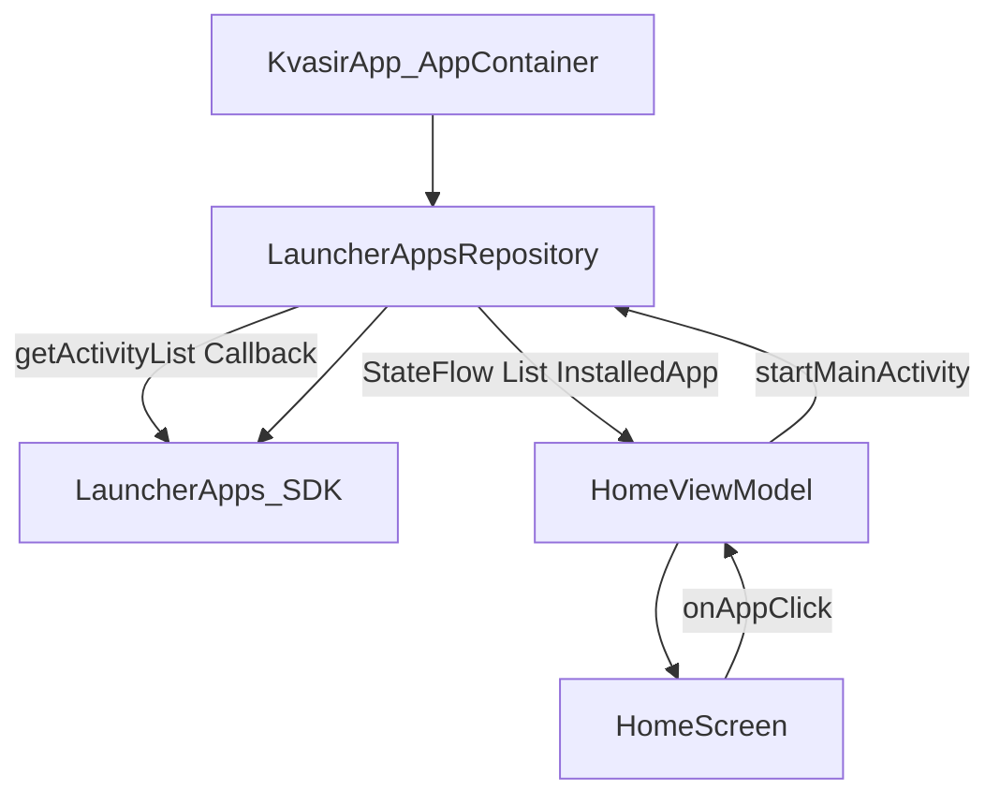

# Plan 002 — Listar y lanzar apps

**Spec:** `specs/002-launcher-apps/spec.md`  
**Estado:** aprobado  
**Rama:** `spec/002-launcher-apps`

## Enfoque

Extender el esqueleto 001: repositorio `LauncherApps` en `AppContainer`, modelo `InstalledApp` sin iconos, `<queries>` en Manifest, y en Home una sección provisional scrolleable (texto) que observa un `StateFlow` y lanza vía ViewModel.



## Archivos

### Crear

- `app/src/main/java/app/kvasir/launcher/domain/model/InstalledApp.kt` — `componentName`, `label`; helper `componentKey`.
- `app/src/main/java/app/kvasir/launcher/data/apps/InstalledAppMapper.kt` — funciones puras: mapear `LauncherActivityInfo` → `InstalledApp`; filtrar propio paquete; ordenar por label (`Collator` / case-insensitive locale). Testeable en JVM con fakes.
- `app/src/main/java/app/kvasir/launcher/data/apps/LauncherAppsRepository.kt` — carga async, `StateFlow<List<InstalledApp>>`, `LauncherApps.Callback`, `launch(app)`.
- `app/src/test/java/app/kvasir/launcher/data/apps/InstalledAppMapperTest.kt` — RF-002-01/04/05.

### Modificar

- `app/src/main/AndroidManifest.xml` — `<queries>` MAIN+LAUNCHER; no tocar HOME/singleTask/back.
- `app/src/main/java/app/kvasir/launcher/di/AppContainer.kt` — exponer `launcherAppsRepository` y arrancar observación una vez.
- `app/src/main/java/app/kvasir/launcher/ui/home/HomeViewModel.kt` — `installedApps` en `HomeUiState`; `launchApp`; factory recibe también el repo de apps.
- `app/src/main/java/app/kvasir/launcher/ui/home/HomeScreen.kt` — cabecera + `LazyColumn` de labels; empty `No se encontraron apps.`; reloj intacto.
- `app/src/main/java/app/kvasir/launcher/MainActivity.kt` — cablear factory con ambos repos; pasar lista y `onAppClick`.
- `app/src/main/res/values/strings.xml` — `apps_installed_header`, `apps_installed_empty`.

### No tocar

Contrato HOME Activity flags, DataStore, overlay, iconos, deps nuevas.

## Decisiones

1. **API** — `LauncherApps` + `Callback` + `startMainActivity`. **Descartado:** solo `PackageManager.queryIntentActivities` + broadcasts (frágiles post-Oreo; peor para launcher).
2. **Perfil** — `Process.myUserHandle()` (usuario primario). **Descartado:** work profile / `UserManager.getUserProfiles()` (fuera de v1).
3. **Callback thread** — registrar con `Handler(Looper.getMainLooper())`; refrescar lista en `Dispatchers.Default` y emitir al `StateFlow`. **Descartado:** trabajo pesado en el hilo del callback sin offload.
4. **Arranque no bloqueante** — `apps` inicia como `emptyList()`; primera emisión cuando termine la carga. Reloj no depende de ese Flow. **Descartado:** loading spinner obligatorio (spec: no inventar filas; empty real solo si tras carga no hay apps).
5. **Empty UI** — mostrar `No se encontraron apps.` solo cuando `appsLoaded == true && apps.isEmpty()`. Mientras carga: sección cabecera sin filas (no placeholders fake). Ampliar `HomeUiState` con `appsLoaded: Boolean`.
6. **Layout** — `Column` (reloj + empty favoritas + CTA) + `LazyColumn(modifier.weight(1f))` para apps. **Descartado:** meter el tick del reloj en el mismo item state que la lista.
7. **Launch fail** — `try/catch` en repo; log; no rethrow. **Descartado:** crash / dialog (fuera de alcance).
8. **Exclusión self** — filtrar `packageName == appContext.packageName`. Incluye no listar la propia Activity HOME.
9. **DI** — `AppContainer` crea el repo y llama `start()` una vez desde `KvasirApp.onCreate` (o init del contenedor). **Descartado:** registrar callback desde Activity (fuga / doble registro).

## Rendimiento

- Modelos: solo `ComponentName` + `String`. Cero `getBadgedIcon` / `Bitmap`.
- Reloj: sigue Composable aislado; no lee `installedApps`.
- Lista: `LazyColumn` + `key(componentKey)`; recomposición al cambiar el Flow, no a 1 Hz.
- Carga off-main; primer frame del reloj independiente.
- Metas dominio: RSS < 80 MB; cold/`onNewIntent` sin regresión por iconos.

## Persistencia / Android

- Persistencia: N/A.
- Manifest: añadir

```xml
<queries>
  <intent>
    <action android:name="android.intent.action.MAIN" />
    <category android:name="android.intent.category.LAUNCHER" />
  </intent>
</queries>
```

- Sin `QUERY_ALL_PACKAGES` / `INTERNET` / permisos peligrosos.
- HOME intent-filter y flags de 001 intactos.

## Dependencias

Sin dependencias nuevas.

## Tests

| RF | Cómo |
| --- | --- |
| RF-002-01, 04, 05 | `InstalledAppMapperTest` (JVM) |
| RF-002-02, 03, 06, 07, 09–11 | Checklist dispositivo + revisión Manifest/`AppContainer` |
| RF-002-08 | Checklist: `ui/` sin imports `LauncherApps`/`PackageManager` |

Validación de build: `./gradlew test assembleDebug`.

## Riesgos

1. **Lista vacía por `<queries>` mal puestos** — Mitigación: checklist RF-002-03; copy vacío.
2. **Doble Callback / fuga** — Mitigación: un solo `start()` en Application; no Context de Activity.
3. **Recomposición con reloj** — Mitigación: `HomeClock` separado; lista en `LazyColumn` con weight.
4. **`startMainActivity` sin source bounds** — Mitigación: pasar `null` bounds / options mínimas; catch errores.

## Siguiente paso

Tras OK de este plan: **tareas 002** → `specs/002-launcher-apps/tasks.md`, luego implementación una tarea por sesión.
