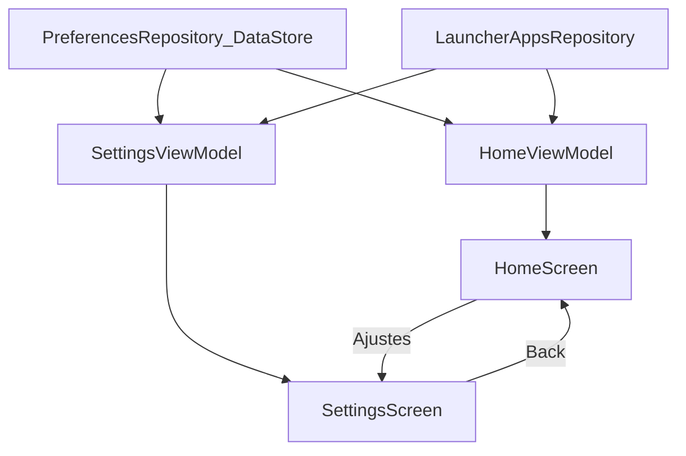

# Plan 003 — Favoritas + DataStore

**Spec:** `specs/003-favorites/spec.md`  
**Estado:** aprobado  
**Rama:** `spec/003-favorites`

## Enfoque

Añadir DataStore Preferences, repositorio de favoritas, resolver puro `favoritas ∩ instaladas`, Home solo con favoritas, y pantalla Ajustes (sin librería Navigation) para el catálogo alta/baja. Quitar de Home la lista «Apps instaladas» de 002.

## Archivos

### Crear

- `app/src/main/java/app/kvasir/launcher/data/prefs/PreferencesKeys.kt` — `favorite_component_keys`.
- `app/src/main/java/app/kvasir/launcher/data/prefs/PreferencesRepository.kt` — DataStore; `favoriteKeys: Flow<Set<String>>`; `addFavorite` / `removeFavorite` / `setFavorite`.
- `app/src/main/java/app/kvasir/launcher/domain/FavoritesResolver.kt` — puro: intersect + sort by label (Collator); JVM-testable.
- `app/src/test/java/app/kvasir/launcher/domain/FavoritesResolverTest.kt`
- `app/src/main/java/app/kvasir/launcher/ui/settings/SettingsViewModel.kt`
- `app/src/main/java/app/kvasir/launcher/ui/settings/SettingsScreen.kt`
- `app/src/main/java/app/kvasir/launcher/ui/KvasirRoot.kt` — estado `Home | Settings` sin Navigation Compose.

### Modificar

- `gradle/libs.versions.toml` + `app/build.gradle.kts` — `datastore-preferences`.
- `app/src/main/java/app/kvasir/launcher/di/AppContainer.kt` — `preferencesRepository`.
- `app/src/main/java/app/kvasir/launcher/ui/home/HomeViewModel.kt` — favoritas resueltas; quitar lista instalada del UI state de Home.
- `app/src/main/java/app/kvasir/launcher/ui/home/HomeScreen.kt` — favoritas + empty + CTA Inicio + botón Ajustes; sin «Apps instaladas».
- `app/src/main/java/app/kvasir/launcher/MainActivity.kt` — montar `KvasirRoot`; factories.
- `app/src/main/res/values/strings.xml` — `settings`, `choose_favorites`, etc.

### No tocar

Manifest HOME/`<queries>`, overlay, hábitos, tema persistido, Room.

## Decisiones

1. **Nav** — estado sellado en `KvasirRoot` (`Home` / `Settings`). **Descartado:** Navigation Compose (deps extra; una sola Activity, dos pantallas).
2. **DataStore** — Preferences + `stringSetPreferencesKey("favorite_component_keys")`. **Descartado:** Room / Proto / SharedPreferences.
3. **Orden UI** — alfabético por label via `FavoritesResolver` (mismo Collator PRIMARY que 002). **Descartado:** orden de inserción (StringSet no ordena).
4. **Huérfanas** — no mostrar en Home; al abrir Ajustes, **podar** keys ausentes del set (escritura async). **Descartado:** dejar basura eterna en DataStore.
5. **Toggle Ajustes** — fila = label + `Switch` (Material3) ligado a `componentKey`. **Descartado:** solo long-press en Home.
6. **Back en Ajustes** — `OnBackPressedCallback` temporal o botón atrás en UI que vuelve a Home; **no** `finish()` de la Activity HOME.
7. **Home Back** — sin cambio (consume, se queda en Home). Si está en Settings, Back → Home.

## Rendimiento

- Un `DataStore` en Application; Flows combinados en ViewModels; reloj aislado.
- Home: lista corta; sin iconos.
- Sin I/O en recomposición del tick 1 Hz.

## Persistencia / Android

- Primer esquema; migración N/A; default set vacío.
- Sin cambio Manifest/permisos/intents.

## Dependencias

`androidx.datastore:datastore-preferences` (versión estable en catalog, p. ej. 1.1.x). Justificada en spec.

## Tests

| RF | Cómo |
| --- | --- |
| RF-003-01, 02, 09 | `FavoritesResolverTest` (+ asserts de clave documentada) |
| RF-003-03…08 | Checklist dispositivo + revisión capas |

Validación de build: `./gradlew test assembleDebug`.

## Riesgos

1. **Back desde Settings mata Home** — Mitigación: no `finish()`; solo cambiar estado raíz.
2. **Race DataStore** — Mitigación: updates atómicos `edit { }` por key.
3. **Lista Home vacía tras migrar de 002** — Esperado (RF-003-09); empty copy claro.

## Siguiente paso

Tras OK de este plan: **tareas 003** → `specs/003-favorites/tasks.md`, luego implementación una tarea por sesión.
