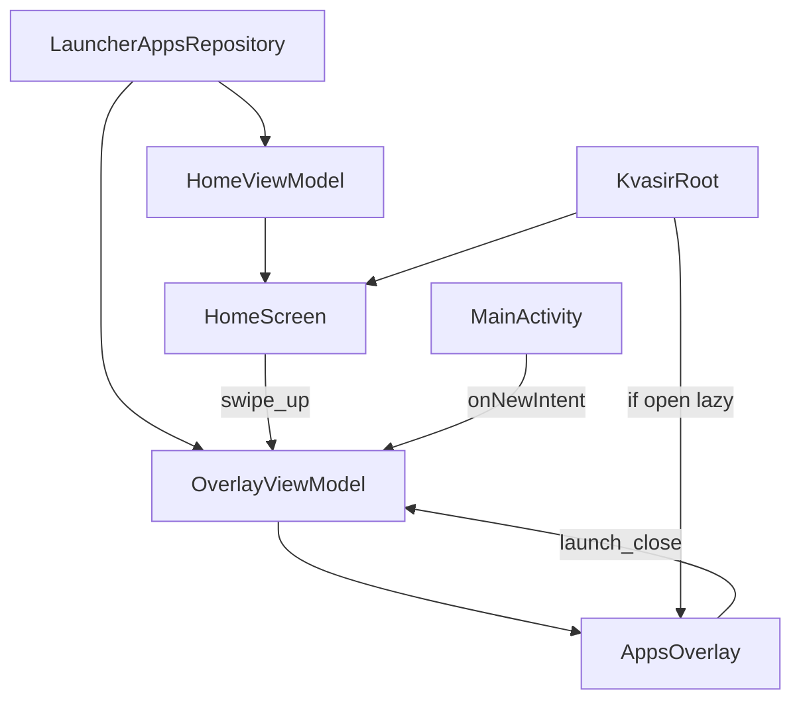

# Plan 004 — Overlay scrubber A–Z

**Spec:** `specs/004-overlay-scrubber/spec.md`  
**Estado:** aprobado  
**Rama:** `spec/004-overlay-scrubber`

## Enfoque

Capa Compose perezosa sobre Home (no pantalla Navigation), ViewModel de overlay que lee `LauncherAppsRepository` (sin tocar favoritas), filtro puro A–Z/`#` testeable en JVM, gestos swipe-up/down + Back + cierre en `onNewIntent`.

## Archivos

### Crear

- `app/src/main/java/app/kvasir/launcher/domain/LetterBucket.kt` — letra inicial A–Z o `#` (locale); filtro de lista.
- `app/src/test/java/app/kvasir/launcher/domain/LetterBucketTest.kt`
- `app/src/main/java/app/kvasir/launcher/ui/overlay/OverlayViewModel.kt` — `isOpen`, `selectedLetter`, apps filtradas; `open`/`close`/`selectLetter`/`launchAndClose`; **sin** `PreferencesRepository`.
- `app/src/main/java/app/kvasir/launcher/ui/overlay/AppsOverlay.kt` — lista + scrubber; Compose sin PM/DataStore.

### Modificar

- `app/src/main/java/app/kvasir/launcher/ui/KvasirRoot.kt` — montar overlay solo si `isOpen`; Back: overlay > Settings > consume Home.
- `app/src/main/java/app/kvasir/launcher/ui/home/HomeScreen.kt` — detectar swipe-up → `onOpenOverlay`.
- `app/src/main/java/app/kvasir/launcher/MainActivity.kt` — factory Overlay VM; `onNewIntent` → `close()`.
- `app/src/main/res/values/strings.xml` — `overlay_letter_empty`.

### No tocar

Manifest/`<queries>`, DataStore/favoritas, Settings catálogo, hábitos, tema, deps.

## Decisiones

1. **Visibilidad** — `OverlayViewModel.isOpen` (StateFlow); UI perezosa en Root. **Descartado:** tercer `RootDestination` (chocaría con Settings y forzaría desmontar Home).
2. **Scrubber estado** — letra + open en VM; al `close()` reset letra/pointer. **Descartado:** persistir en DataStore (spec: efímero).
3. **Filtro** — puro `LetterBucket` + filter; al abrir letra inicial `'A'`. **Descartado:** lista completa sin filtro hasta tocar scrubber (spec exige scrubber como affordance).
4. **Gestos** — `pointerInput` / drag vertical en Home (up) y Overlay (down); umbral ~56 dp. **Descartado:** botón «Apps» (spec: swipe-up).
5. **Back** — `BackHandler` en Root: si overlay abierto → close; si Settings → Home; si no, callback Activity (no finish).
6. **Favoritas** — Overlay VM no recibe `PreferencesRepository`. **Descartado:** long-press → favorita.

## Rendimiento

- Overlay no compuesto si cerrado; al cerrar `close()` resetea estado.
- Filtrado en VM/dominio sobre lista en memoria; LazyColumn; sin iconos.
- Reloj sigue aislado en `HomeClock`; no I/O en frame del scrubber.

## Persistencia / Android

N/A esquema. Sin Manifest/permisos/intents. Sin `SYSTEM_ALERT_WINDOW`.

## Dependencias

Ninguna nueva.

## Tests

| RF | Cómo |
| --- | --- |
| RF-004-04, 05 | `LetterBucketTest` |
| RF-004-01…03, 06…08 | Checklist + revisión capas |

Validación de build: `./gradlew test assembleDebug`.

## Riesgos

1. **Back mata Activity** — Mitigación: BackHandler overlay antes del consume Home.
2. **Swipe vs scroll favoritas** — Mitigación: gesto en área Home / umbral; LazyColumn consume scroll vertical interno.
3. **onNewIntent no cierra** — Mitigación: `close()` explícito en `MainActivity.onNewIntent`.

## Siguiente paso

Tras OK de este plan: **tareas 004** → `specs/004-overlay-scrubber/tasks.md`, luego implementación una tarea por sesión.
