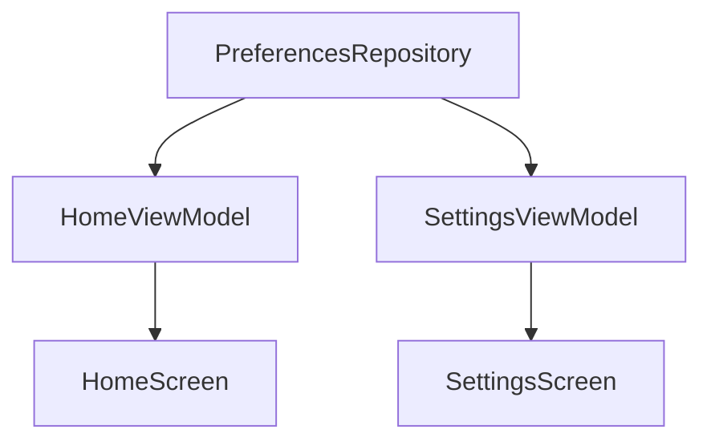

# Plan 005 — Hábitos del día

**Spec:** `specs/005-habits/spec.md`  
**Estado:** aprobado  
**Rama:** `spec/005-habits`

## Enfoque

Extender DataStore (claves JSON aditivas), codec/`HabitDayRoll` puros testeables, Flows en `PreferencesRepository`, Home con sección hábitos + Checkbox, Ajustes con CRUD debajo del catálogo de favoritas. Sin deps nuevas.

## Archivos

### Crear

- `app/src/main/java/app/kvasir/launcher/domain/model/Habit.kt` — `id`, `label`.
- `app/src/main/java/app/kvasir/launcher/domain/model/HabitDayState.kt` — `epochDay`, `completedIds`.
- `app/src/main/java/app/kvasir/launcher/domain/HabitJson.kt` — serialize/parse `org.json` (habits + day state).
- `app/src/main/java/app/kvasir/launcher/domain/HabitDayRoll.kt` — si `epochDay != today` → empty completed + today.
- `app/src/test/java/app/kvasir/launcher/domain/HabitJsonTest.kt`
- `app/src/test/java/app/kvasir/launcher/domain/HabitDayRollTest.kt`

### Modificar

- `app/src/main/java/app/kvasir/launcher/data/prefs/PreferencesKeys.kt` — `habits_json`, `habit_day_state_json` (`stringPreferencesKey`).
- `app/src/main/java/app/kvasir/launcher/data/prefs/PreferencesRepository.kt` — Flows + `setHabits` / `toggleCompleted` / CRUD helpers; apply `HabitDayRoll` en lectura/escritura del day state.
- `app/src/main/java/app/kvasir/launcher/ui/home/HomeViewModel.kt` / `HomeScreen.kt` — sección hábitos + empty + toggle; reloj intacto.
- `app/src/main/java/app/kvasir/launcher/ui/settings/SettingsViewModel.kt` / `SettingsScreen.kt` — sección hábitos: añadir / eliminar / renombrar (TextField + botones).
- `app/src/main/res/values/strings.xml` — copy ES.

### No tocar

Manifest/`<queries>`, overlay, favoritas keys, tema, deps Gradle.

## Decisiones

1. **JSON** — `org.json` + codec de dominio. **Descartado:** kotlinx.serialization (deps).
2. **IDs** — `UUID.randomUUID().toString()` al crear. **Descartado:** índices posicionales (rompe al borrar).
3. **Reset** — `HabitDayRoll.ensureToday(state, todayEpochDay)` en repo al mapear Flow y antes de escribir toggle. **Descartado:** WorkManager a medianoche (overkill v1).
4. **UI Home** — `Checkbox` Material3 por fila. **Descartado:** solo tap en label sin control visible.
5. **Ajustes** — misma `SettingsScreen`: bloque favoritas + bloque hábitos (scroll). **Descartado:** pantalla Settings aparte / Navigation extra.
6. **Borrar hábito** — quitar de lista JSON; ids huérfanos en day state se ignoran en UI (opcional prune al borrar).

## Rendimiento

- Flows DataStore; combine en VMs; `HomeClock` sin cambios.
- Listas cortas; sin Bitmap; sin I/O en tick 1 Hz.

## Persistencia / Android

Claves aditivas; migración N/A. Sin Manifest/permisos/intents.

## Dependencias

Ninguna nueva.

## Tests

| RF | Cómo |
| --- | --- |
| RF-005-01, 04, 08 | `HabitJsonTest`, `HabitDayRollTest` |
| RF-005-02, 03, 05…07 | Checklist + revisión capas |

Validación de build: `./gradlew test assembleDebug`.

## Riesgos

1. **JSON corrupto** — Mitigación: parse fail → default vacío (no crash Home).
2. **Toggle + cambio de día concurrente** — Mitigación: roll + edit atómico en `edit { }`.
3. **Settings largo** — Mitigación: un `LazyColumn`/`Column`+scroll con dos secciones.

## Siguiente paso

Tras OK de este plan: **tareas 005** → `specs/005-habits/tasks.md`, luego implementación una tarea por sesión.
