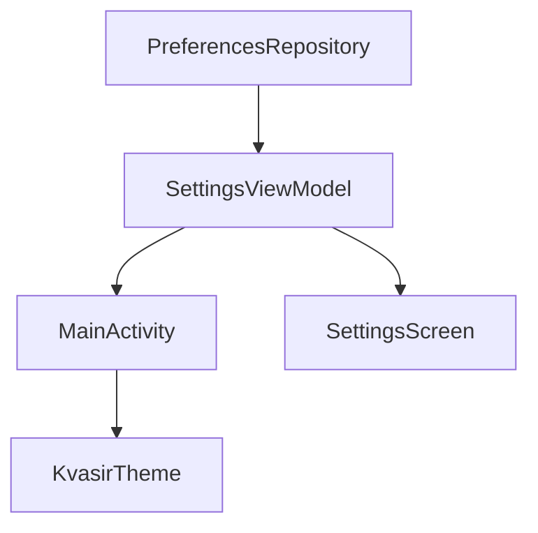

# Plan 006 — Tema claro/oscuro

**Spec:** `specs/006-theme/spec.md`  
**Estado:** aprobado  
**Rama:** `spec/006-theme`

## Enfoque

Clave DataStore aditiva `theme_mode`, enum/`parse` de dominio, Flow en `PreferencesRepository`, Switch en Ajustes, `MainActivity` observa el modo y pasa `darkTheme` a `KvasirTheme` (sin sistema, sin `setDefaultNightMode`).

## Archivos

### Crear

- `app/src/main/java/app/kvasir/launcher/domain/model/ThemeMode.kt` — `Light`/`Dark`; `fromStorage` / `storageValue`; default Light.
- `app/src/test/java/app/kvasir/launcher/domain/model/ThemeModeTest.kt`

### Modificar

- `app/src/main/java/app/kvasir/launcher/data/prefs/PreferencesKeys.kt` — `theme_mode`.
- `app/src/main/java/app/kvasir/launcher/data/prefs/PreferencesRepository.kt` — `themeMode: Flow<ThemeMode>`; `setThemeMode`.
- `app/src/main/java/app/kvasir/launcher/ui/settings/SettingsViewModel.kt` — exponer modo + `setDarkTheme`; incluir en UI state.
- `app/src/main/java/app/kvasir/launcher/ui/settings/SettingsScreen.kt` — Switch `Tema oscuro` (arriba o tras hábitos).
- `app/src/main/java/app/kvasir/launcher/ui/theme/Theme.kt` — `darkTheme` obligatorio desde fuera (sin `isSystemInDarkTheme` por defecto).
- `app/src/main/java/app/kvasir/launcher/MainActivity.kt` — `collectAsStateWithLifecycle` del modo → `KvasirTheme(darkTheme = …)`.
- `app/src/main/java/app/kvasir/launcher/ui/KvasirRoot.kt` — pasar props de tema al SettingsScreen.
- `app/src/main/res/values/strings.xml` — `theme_dark`.

### No tocar

Manifest, overlay, favoritas/hábitos keys (salvo lectura compartida del repo), deps.

## Decisiones

1. **Fuente de verdad** — prefs → `SettingsViewModel.themeMode` (o campo en `SettingsUiState`) → MainActivity + Settings Switch. **Descartado:** ViewModel solo de tema (deps/DI extra innecesarias).
2. **Default** — ausente/inválido → `Light`. **Descartado:** seguir sistema (spec: solo Light/Dark).
3. **Aplicación** — solo `KvasirTheme(darkTheme)`; nunca `setDefaultNightMode`. **Descartado:** AppCompat night mode.
4. **Switch** — checked = Dark. **Descartado:** tri-state Sistema.

## Rendimiento

- Un Flow de string; cambio puntual de scheme; `HomeClock` sin cambios.

## Persistencia / Android

Clave aditiva; migración N/A. Sin Manifest. Sin `setDefaultNightMode`.

## Dependencias

Ninguna nueva.

## Tests

| RF | Cómo |
| --- | --- |
| RF-006-01, 06 | `ThemeModeTest` |
| RF-006-02…05 | Checklist + grep `setDefaultNightMode` |

Validación de build: `./gradlew test assembleDebug`.

## Riesgos

1. **Flash claro→oscuro al arrancar** — Mitigación: `stateIn` initial Light (igual default); aceptable v1.
2. **Settings desmontado y tema stale** — Mitigación: Flow en VM con `WhileSubscribed` o `Eagerly` desde MainActivity; MainActivity mantiene VM viva.

## Siguiente paso

Tras OK de este plan: **tareas 006** → `specs/006-theme/tasks.md`, luego implementación una tarea por sesión.
