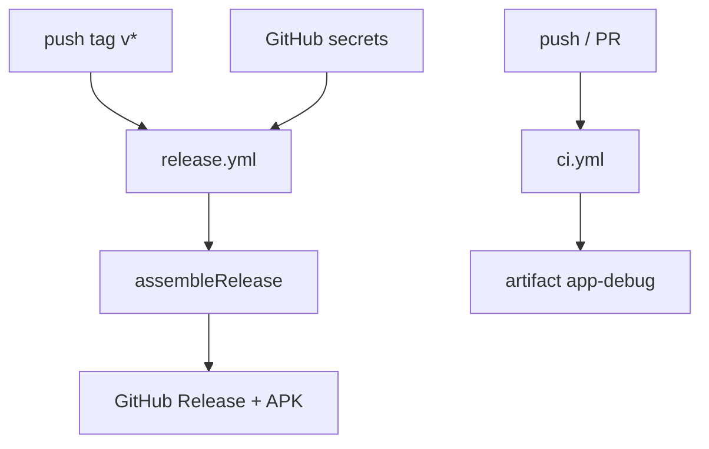

# Plan 007 — Endurecimiento v1

**Spec:** `specs/007-v1-hardening/spec.md`  
**Estado:** aprobado  
**Rama:** `spec/007-v1-hardening`

## Enfoque

Documentación y distribución: alinear README y docs con v1 real, publicar checklist de smoke en dispositivo (001–006), y añadir un workflow de GitHub Release en tags `v*` que firme un APK **release** con secrets (keystore fuera del repo). El CI de push/PR sigue subiendo solo el APK debug. Sin cambios de producto Home ni Manifest HOME.

## Archivos

### Crear

- `docs/device-checklist.md` — smoke 001–006 (Home/Inicio, favoritas, overlay, hábitos, tema, Back/`onNewIntent`).
- `docs/signing.md` — crear keystore, `keystore.properties` local, secrets GitHub, flujo de tag → Release.
- `.github/workflows/release.yml` — trigger `push` tags `v*`; decode keystore; `assembleRelease`; crear GitHub Release con el APK.
- `keystore.properties.example` — plantilla sin secretos (`storeFile`, `storePassword`, `keyAlias`, `keyPassword`).

### Modificar

- `README.md` — quitar “proyecto Android aún no está”; estado v1 usable; cómo bajar APK (Actions debug y/o Release firmado); elegir como Inicio; UI en español; enlace a checklist y a firma.
- `docs/git.md` — documentar workflow de release vs CI debug; no Play Store.
- `docs/README.md` — índice: checklist + signing si aplica.
- `.gitignore` — `keystore.properties`, `*.jks`, `*.keystore` (y equivalentes).
- `app/build.gradle.kts` — `signingConfigs` release leyendo `keystore.properties` si existe; `buildTypes.release.signingConfig` cuando haya firma; sin minify forzado nuevo (sigue `isMinifyEnabled = false`).

### No tocar

- Manifest / intents HOME, permisos, `<queries>`.
- Código de UI/dominio 001–006 (ViewModels, DataStore keys, Compose).
- `.github/workflows/ci.yml` salvo mención cruzada en docs (el job debug **se mantiene** tal cual).

## Decisiones

1. **Workflow separado** — `release.yml` solo en tags `v*`. **Descartado:** meter release en `ci.yml` (mezcla push/PR con publicación y alarga el job cotidiano).
2. **Firma Gradle** — si existe `keystore.properties` en la raíz (o path documentado), release usa ese `signingConfig`; si no, release local puede seguir unsigned/debug-signing según AGP (documentar). En CI, el workflow escribe `keystore.properties` + fichero keystore desde secrets antes de `assembleRelease`. **Descartado:** keystore en el repo o en artifacts.
3. **Secrets** — `KEYSTORE_BASE64`, `KEYSTORE_PASSWORD`, `KEY_ALIAS`, `KEY_PASSWORD`. Sin ellos: el job **falla al inicio** con mensaje claro (no publica Release vacío ni APK sin firmar como “release”). **Descartado:** skip silencioso (oculta mal configuración).
4. **Publicación** — `softprops/action-gh-release` (o `gh release create`) adjuntando el APK release. **Descartado:** Play Store / Play Console.
5. **Checklist** — un solo `docs/device-checklist.md` enlazado desde README. **Descartado:** checklist embebida solo en cada `specs/*/spec.md` (ya existen trozos; falta consolidar).
6. **versionName/versionCode** — sin bump automático en esta spec (el tag `v*` nombra el Release; alinear `versionName` con el tag queda opcional/manual o spec futura). **Descartado:** plugin de versionado semver ahora.

## Rendimiento

**No toca el proceso Home** en runtime. Solo docs, gitignore, firma de build y CI. Presupuesto RSS / recomposición / arranque de `docs/domain.md` intacto.

## Persistencia / Android

- DataStore: N/A.
- Manifest / permisos / intents: N/A (RF-007-05).

## Dependencias

Ninguna dependencia nueva en la app. Acciones de GitHub ya usadas o análogas (`actions/checkout`, `setup-java`, upload/release): coste cero en APK; beneficio = distribución firmada.

## Tests

| RF | Cómo |
| --- | --- |
| RF-007-01 | Checklist: README coherente con repo + pasos de instalación |
| RF-007-02 | Checklist: `docs/device-checklist.md` cubre 001–006 |
| RF-007-03 | Manual/CI: con secrets, tag `v*` de prueba → Release + APK; sin secrets → fallo claro |
| RF-007-04 | Checklist: keystore/properties no versionados; `docs/signing.md` + example |
| RF-007-05 | Checklist: sin Play Store; Manifest HOME sin diff |

Validación de build local (cuando haya keystore): `./gradlew test assembleRelease` (o `assembleDebug` si aún no hay firma local). CI push/PR: sin cambio de contrato debug.

## Riesgos

1. **Secrets mal configurados** — Mitigación: fail fast + doc de nombres exactos de secrets.
2. **Reinstalar debug sobre release (o viceversa) con distinta firma** — Mitigación: documentar en README/signing que hay que desinstalar antes si cambia el certificado.
3. **Publicar APK no firmado por error** — Mitigación: no crear Release si falta signing; `assembleRelease` con signingConfig obligatorio en el job.

## Siguiente paso

Tras OK de este plan: **tareas 007** → `specs/007-v1-hardening/tasks.md`, luego implementación una tarea por sesión.
