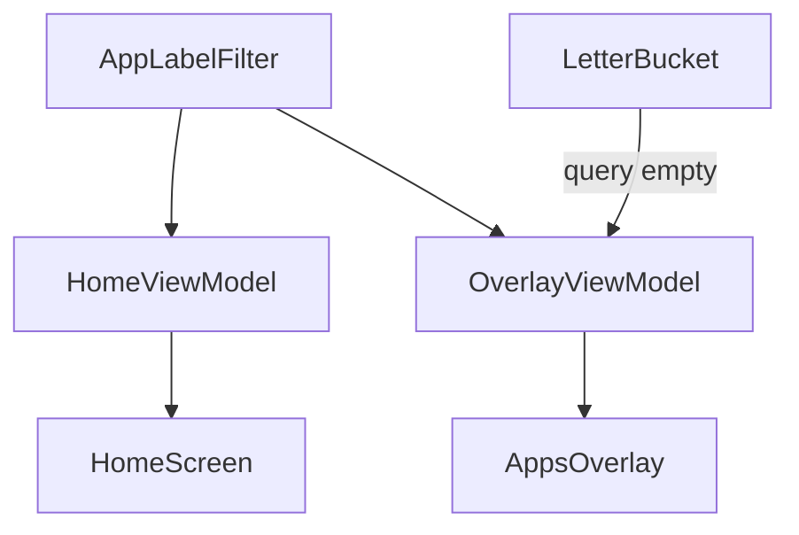

# Plan 008 — Búsqueda de apps

**Spec:** `specs/008-app-search/spec.md`  
**Estado:** aprobado  
**Rama:** `spec/008-app-search`

## Enfoque

Filtro puro de dominio por substring del `label` (locale), reutilizado en Home (favoritas ya resueltas) y Overlay (todas las instaladas). Queries efímeras en cada ViewModel. En overlay, si la query no está vacía, se ignora `LetterBucket`; si está vacía, se restaura el scrubber 004. Sin DataStore ni deps nuevas.

## Archivos

### Crear

- `app/src/main/java/app/kvasir/launcher/domain/AppLabelFilter.kt` — `matches(label, query, locale)`; `filterByQuery(apps, query, locale)` (query en blanco → lista intacta).
- `app/src/test/java/app/kvasir/launcher/domain/AppLabelFilterTest.kt` — substring, case, locale, vacío, query vs lista.

### Modificar

- `app/src/main/java/app/kvasir/launcher/ui/home/HomeViewModel.kt` — `searchQuery` efímero; tras `FavoritesResolver`, aplicar `AppLabelFilter`; exponer query + `setSearchQuery` en estado/API.
- `app/src/main/java/app/kvasir/launcher/ui/home/HomeScreen.kt` — `OutlinedTextField` / campo de búsqueda; empty de “sin coincidencias” vs “sin favoritas”.
- `app/src/main/java/app/kvasir/launcher/ui/overlay/OverlayViewModel.kt` — `searchQuery` en `combine`; query no vacía → filtro label sobre `snapshot.apps` (ignorar letra; al escribir resetear letra a `'A'` o dejarla sin efecto); query vacía → `LetterBucket.filterByLetter`; `close()` / `open()` limpian query.
- `app/src/main/java/app/kvasir/launcher/ui/overlay/AppsOverlay.kt` — campo búsqueda; empty `search_apps_empty` vs `overlay_letter_empty` según query.
- `app/src/main/java/app/kvasir/launcher/ui/KvasirRoot.kt` — cablear callbacks de query Home/Overlay si hace falta.
- `app/src/main/res/values/strings.xml` — `search_apps_hint` = `Buscar apps`; `search_apps_empty` = `Ninguna app coincide.`

### No tocar

Manifest/`<queries>`, DataStore/esquema, `FavoritesResolver` (solo componer después), Settings catálogo, hábitos, tema, `LauncherAppsRepository`, deps, iconos.

## Decisiones

1. **Filtro compartido** — `AppLabelFilter` en `domain/` (JVM-testeable). **Descartado:** filtrar solo en Compose con `remember` (rompe capas RF-008-06 y dificulta tests).
2. **Home empty** — sin favoritas (003) vs query sin match (`search_apps_empty`). **Descartado:** un solo empty genérico (confunde “no hay favoritas” con “no coincide”).
3. **Overlay query vs letra** — query no vacía → filtrar todas; scrubber visible pero sin efecto en lista; al tipear, resetear `selectedLetter` a `'A'` (estado limpio). **Descartado:** AND letra+texto; **descartado:** ocultar scrubber (más churn de layout).
4. **Limpieza overlay** — `close()` limpia query (+ letra como 004); `open()` parte con query vacía; `onNewIntent` ya llama `close()`. **Descartado:** persistir query Home/Overlay en DataStore.
5. **Home query** — efímera en `HomeViewModel`; no se limpia al ir a Settings (aceptable); no DataStore. **Descartado:** query global única Home+Overlay (estados distintos por superficie).

## Rendimiento

- Filtro O(n) sobre labels en memoria; sin bitmaps.
- `HomeClock` intacto (no depende de query).
- Overlay cerrado: `filteredApps` vacío + query reseteada en `close()`; montaje perezoso 004 se mantiene.
- RSS idle / cold start / `onNewIntent` metas de `docs/domain.md` intactas.

## Persistencia / Android

N/A (sin esquema DataStore; sin Manifest).

## Dependencias

Ninguna nueva. Reutilizar `OutlinedTextField` (ya en Settings).

## Tests

| RF | Cómo |
| --- | --- |
| RF-008-01, 02 | `AppLabelFilterTest` + checklist UI Home/Overlay |
| RF-008-03, 04 | Test de política query-vs-letra (función pura o helper usado por Overlay VM) + checklist |
| RF-008-05 | Checklist: cerrar / lanzar / Home limpia query overlay |
| RF-008-06 | Revisión imports Compose |
| RF-008-07 | Sin deps nuevas; `./gradlew test assembleDebug` |

## Riesgos

1. **Teclado tapa lista** — Mitigación: campo arriba; IME padding Compose estándar si hace falta sin deps nuevas.
2. **Recomposiciones Home** — Mitigación: query en VM; no invalidar `HomeClock`.
3. **Scrubber confunde con query activa** — Mitigación: documentado en spec; lista ignora letra; reset letra al tipear.

## Siguiente paso

Tras OK de este plan: **tareas 008** → `specs/008-app-search/tasks.md`, luego implementación una tarea por sesión.
