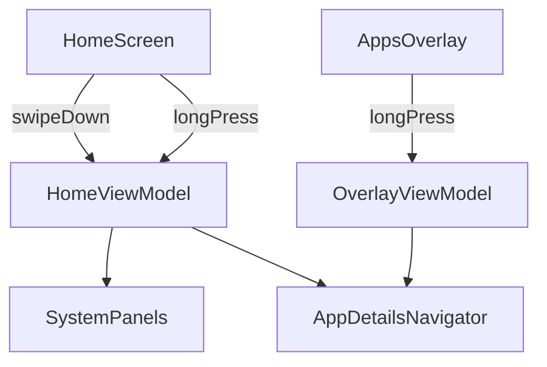

# Plan 009 — Gestos Home (panel sistema + info de app)

**Spec:** `specs/009-gestures/spec.md`  
**Estado:** aprobado  
**Rama:** `spec/009-gestures`

## Enfoque

Dos affordances: (1) swipe-down en Home llama a un helper de proceso que intenta **quick settings** y, si falla, **notificaciones** (`EXPAND_STATUS_BAR` + best-effort); (2) long-press en filas de app (Home + overlay) abre `ACTION_APPLICATION_DETAILS_SETTINGS` vía ViewModel/repo. Compose solo detecta gestos. Overlay mantiene swipe-down = cerrar (004).

## Archivos

### Crear

- `app/src/main/java/app/kvasir/launcher/data/system/SystemPanels.kt` — `expandPreferredPanel(context)`: intenta `expandSettingsPanel`, luego `expandNotificationsPanel` (vía `StatusBarManager` / reflexión documentada); catch-all → no-op; sin tumbar proceso.
- `app/src/main/java/app/kvasir/launcher/data/apps/AppDetailsNavigator.kt` (o método en repo) — construye e inicia intent de detalles por `packageName` (`Settings.ACTION_APPLICATION_DETAILS_SETTINGS` + `Uri.fromParts("package", …)` + `NEW_TASK`).
- `app/src/test/java/app/kvasir/launcher/data/apps/AppDetailsNavigatorTest.kt` — URI/action del intent (JVM puro si se extrae builder sin Context).

### Modificar

- `app/src/main/AndroidManifest.xml` — `uses-permission` `android.permission.EXPAND_STATUS_BAR` (normal).
- `app/src/main/java/app/kvasir/launcher/ui/home/HomeScreen.kt` — `onVerticalSwipe(onSwipeUp, onSwipeDown)`; filas favoritas con `combinedClickable` (tap = lanzar, long-press = info).
- `app/src/main/java/app/kvasir/launcher/ui/home/HomeViewModel.kt` — `expandSystemPanel()`; `openAppDetails(app)` (sin mutar prefs).
- `app/src/main/java/app/kvasir/launcher/ui/overlay/AppsOverlay.kt` — long-press en filas → callback info; swipe-down sigue `onClose`.
- `app/src/main/java/app/kvasir/launcher/ui/overlay/OverlayViewModel.kt` — `openAppDetails(app)` (no cierra overlay; no toca favoritas).
- `app/src/main/java/app/kvasir/launcher/ui/KvasirRoot.kt` — cablear callbacks nuevos.
- `app/src/main/java/app/kvasir/launcher/di/AppContainer.kt` — exponer navigator/panels si hace falta (o factories con `appContext`).
- `docs/device-checklist.md` — ítems smoke 009 (opcional pero útil; no bloquea RF).

### No tocar

DataStore, favoritas alta/baja, scrubber/búsqueda 008 salvo long-press en filas, tema, hábitos, deps, iconos, intent-filter HOME.

## Decisiones

1. **Panel** — helper `SystemPanels` con Application context; orden QS → notificaciones → no-op. **Descartado:** solo notificaciones (spec pide preferir QS). **Descartado:** depender de APIs públicas inexistentes.
2. **EXPAND_STATUS_BAR** — declarar permiso normal. **Descartado:** sin permiso (fallaría en más OEM). No `STATUS_BAR` privilegiado.
3. **Reflexión** — acotada a métodos conocidos de `StatusBarManager`; try/catch por intento. **Descartado:** crash si el método no existe.
4. **Detalles de app** — intent Settings estándar por package; sin menú Compose. **Descartado:** desinstalación directa (necesita confirmación SO / UX extra).
5. **Long-press overlay** — abre info; **no** cierra overlay (Back del SO vuelve al overlay). **Descartado:** `launchAndClose` en long-press.
6. **Detección UI** — `combinedClickable` en filas; no long-press en Checkbox/hábitos/campo búsqueda. **Descartado:** menú contextual Material.

## Rendimiento

- Llamadas puntuales al sistema; sin bitmaps ni estado persistente nuevo.
- `HomeClock` intacto.
- Overlay perezoso 004 intacto; long-press no monta capa extra.

## Persistencia / Android

- DataStore: N/A.
- Manifest: + `EXPAND_STATUS_BAR`. Sin cambio HOME / `<queries>`.

## Dependencias

Ninguna nueva.

## Tests

| RF | Cómo |
| --- | --- |
| RF-009-01, 02, 03 | Checklist dispositivo (panel / overlay close / swipe-up) |
| RF-009-04 | `AppDetailsNavigatorTest` (intent) + checklist Home/overlay |
| RF-009-05 | Checklist: favoritas intactas tras long-press |
| RF-009-06 | Revisión imports Compose |
| RF-009-07 | `./gradlew test assembleDebug`; panel fail = no crash |

## Riesgos

1. **OEM bloquea expand panel** — Mitigación: fallback notificaciones + no-op; documentar best-effort en checklist.
2. **Long-press vs scroll** — Mitigación: umbral Compose default de `combinedClickable`; solo en filas de label.
3. **Conflicto swipe Home con LazyColumn** — Mitigación: mismo `onVerticalSwipe` 004 (no consume); umbral 56 dp.

## Siguiente paso

Tras OK de este plan: **tareas 009** → `specs/009-gestures/tasks.md`, luego implementación una tarea por sesión.
