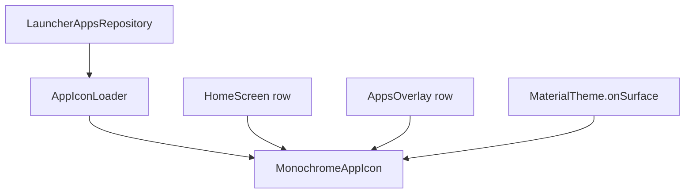

# Plan 010 — Iconos monocromos

**Spec:** `specs/010-monochrome-icons/spec.md`  
**Estado:** aprobado  
**Rama:** `spec/010-monochrome-icons`

## Enfoque

Cargar el drawable real del componente vía `LauncherApps` en un **loader de data** (no en Compose). En Home y overlay, cada fila muestra un icono ~28 dp con **`ColorFilter` tint `SrcIn`** usando `MaterialTheme.colorScheme.onSurface` (claro/oscuro gratis). Sin Coil/Glide. Sin meter `Bitmap` en `InstalledApp` ni cache global ilimitada; LRU pequeña opcional de drawables o carga por `componentKey` con dispose al salir de composición.

## Archivos

### Crear

- `app/src/main/java/app/kvasir/launcher/data/apps/AppIconLoader.kt` — `loadDrawable(componentKey / InstalledApp): Drawable?` con Application context + `LauncherApps` (p. ej. `getActivityList` / match `ComponentName` + `getBadgedIcon(density)`); try/catch; sin Activity.
- `app/src/main/java/app/kvasir/launcher/ui/icons/MonochromeAppIcon.kt` — Composable: pide drawable al loader (vía parámetro / CompositionLocal desde `AppContainer`); `LaunchedEffect(componentKey)`; pinta con tint `SrcIn` + tamaño fijo; placeholder vacío si null. **No** importa `LauncherApps`/`PackageManager`.
- Opcional: `AppIconLoader` con `LruCache<String, Drawable>(maxSize ≈ 48)` de drawables (no Bitmap a resolución completa); documentar límite.

### Modificar

- `app/src/main/java/app/kvasir/launcher/di/AppContainer.kt` — exponer `AppIconLoader`.
- `app/src/main/java/app/kvasir/launcher/MainActivity.kt` / `KvasirRoot.kt` — proveer loader a la UI (CompositionLocal o props).
- `app/src/main/java/app/kvasir/launcher/ui/home/HomeScreen.kt` — fila favorita: `Row(icon + label)`.
- `app/src/main/java/app/kvasir/launcher/ui/overlay/AppsOverlay.kt` — fila app: mismo patrón.
- Comentario en `InstalledApp.kt` — sigue sin Bitmap; iconos fuera del modelo.

### No tocar

Ajustes catálogo, DataStore, Manifest/`<queries>`, reloj tipográfico, calendario, deps nuevas, scrubber/búsqueda salvo layout de fila.

## Decisiones

1. **Modelo** — `InstalledApp` sin campo icono. **Descartado:** embeber `Bitmap` en el snapshot (RAM + invalidación al tema).
2. **Tinte** — `ColorFilter.tint(onSurface, BlendMode.SrcIn)` en Compose (silueta monocroma). **Descartado:** icon pack; **descartado:** ColorMatrix greyscale sin unificar al tema.
3. **API de carga** — `AppIconLoader` + `LauncherApps.getBadgedIcon`. **Descartado:** Coil (deps + cache agresiva).
4. **Cache** — sin cache o LRU ≤ ~48 drawables por `componentKey`; al desmontar overlay las filas liberan painters. **Descartado:** map ilimitado de Bitmap.
5. **Tamaño** — 28 dp (dentro de 24–32). **Descartado:** grilla / iconos grandes.
6. **Tema** — tint desde `MaterialTheme` (ya cableado a `ThemeMode`). **Descartado:** leer DataStore en el loader.
7. **Ajustes** — fuera de 010 (spec).

## Rendimiento

- Carga async por fila (`Dispatchers.IO` / Default); HomeClock intacto.
- Overlay perezoso: iconos solo mientras `isOpen` y filas compostas.
- RSS idle: overlay cerrado no monta filas → no retiene painters del overlay.
- Scrubber: evitar `toBitmap` enorme; density del icono acotada al tamaño de fila.

## Persistencia / Android

N/A DataStore. Sin permisos ni Manifest nuevos.

## Dependencias

Ninguna nueva. Si hace falta `rememberDrawablePainter` de Accompanist: **no** — usar `Drawable` → `Bitmap` acotado (`toBitmap(w,h)`) + `asImageBitmap()` + `Image` + tint, o `AndroidView(ImageView)` con colorFilter; preferir lo que no añada deps.

## Tests

| RF | Cómo |
| --- | --- |
| RF-010-01…04 | Checklist dispositivo (Home/overlay, tema claro/oscuro) |
| RF-010-05 | Revisión imports `ui/` (sin LauncherApps/PM en Composables de icono salvo AndroidView wrapper sin PM) |
| RF-010-06 | Checklist: cerrar overlay; sin cache ilimitada en código |
| RF-010-07 | Diff Gradle sin deps nuevas |
| Loader | Unitaria opcional con fake si se extrae match de `ComponentName` puro; si no, checklist |

Validación de build: `./gradlew test assembleDebug`.

## Riesgos

1. **Adaptive icons / capas** — SrcIn puede verse “plano”; aceptable hiperfocus. Mitigación: `mutate()` antes de tint.
2. **Jank al scrubber** — Mitigación: icon size fijo; no bloquear main en load; no precargar todo el alfabeto.
3. **Fugas** — Mitigación: Application context en loader; no Activity; LRU acotada.

## Siguiente paso

Tras OK de este plan: **tareas 010** → `specs/010-monochrome-icons/tasks.md`, luego implementación una tarea por sesión.
