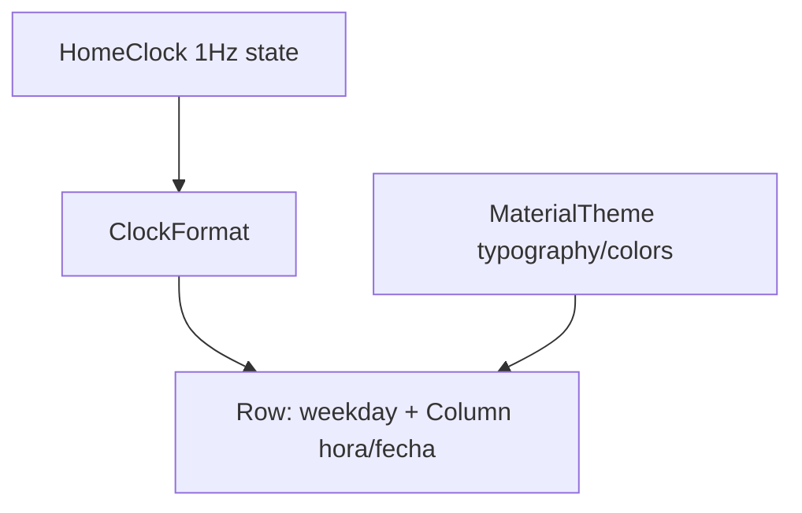

# Plan 011 — Reloj tipográfico

**Spec:** `specs/011-typographic-clock/spec.md`  
**Estado:** aprobado  
**Rama:** `spec/011-typographic-clock`

## Enfoque

Rediseñar solo el bloque `HomeClock`: layout tipográfico estilo Niagara (**día abreviado dominante** + hora + fecha), manteniendo el tick 1 Hz aislado. La lógica de formato pura vive en `ClockFormat` (JVM-testeable, locale del dispositivo). Sin fuentes nuevas, sin calendario, sin tocar ViewModels ni DataStore.

## Archivos

### Modificar

- `app/src/main/java/app/kvasir/launcher/ui/home/ClockFormat.kt` — añadir `formatWeekdayAbbreviated` (p. ej. patrón `EEE` + locale; normalizar a mayúsculas); ajustar o añadir `formatDate` corto (día+mes del locale, sin forzar año si el locale lo permite con patrón tipo `d MMM` / `MMM d`); conservar `formatTime` basado en preferencia/locale del sistema.
- `app/src/main/java/app/kvasir/launcher/ui/home/HomeClock.kt` — layout `Row`: Text día (estilo display / peso bold / tamaño dominante) + `Column` con hora (`headline`/`display` menor) y fecha (`title`/`body` + `onSurfaceVariant`); tick 1 Hz intacto; sin calendario.
- `app/src/test/java/app/kvasir/launcher/ui/home/ClockFormatTest.kt` — tests ES/US para weekday + fecha corta + hora (RF-011-01…03).
- Comentario de spec en `HomeClock` / `ClockFormat`: citar **011** + RF.

### No tocar

`HomeScreen` salvo si hace falta un `Spacer` menor (preferir no); overlay; iconos; hábitos; Ajustes; Manifest; DataStore; Gradle deps; calendario (012).

## Decisiones

1. **Layout** — `Row(Alignment.Bottom/CenterVertically)`: weekday a la izquierda, hora+fecha a la derecha en `Column`. **Descartado:** solo apilar tres líneas (menos “Niagara”); **descartado:** día a pantalla completa sin hora visible.
2. **Abreviatura** — `DateTimeFormatter.ofPattern("EEE", locale)` + `uppercase(locale)`. **Descartado:** nombre completo (`EEEE`) — ocupa demasiado; **descartado:** hardcode `LUN`/`MAR` en español.
3. **Fecha** — patrón corto localizado (`d MMM` / equivalente vía `ofPattern` con locale), no `FormatStyle.FULL` (demasiado largo bajo el día grande). **Descartado:** fecha FULL de 001.
4. **Hora** — mantener `ofLocalizedTime(FormatStyle.MEDIUM)` (12/24 h del sistema). **Descartado:** toggle en Ajustes.
5. **Tipografía** — `MaterialTheme.typography` + `fontSize`/`fontWeight` en el Text del día (p. ej. ~56–72 sp o `displayLarge` + Bold). **Descartado:** `.ttf` empaquetado; **descartado:** Google Fonts / deps.
6. **Estado** — `now` solo dentro de `HomeClock`. **Descartado:** subir el tick al `HomeViewModel` (recompondría más árbol).

## Rendimiento

- Sin I/O, sin permisos, sin Bitmap.
- Recomposición: solo hijos de `HomeClock` cuando cambia `now`.
- Formateo barato en main thread a 1 Hz (aceptable; si se midiera jank, memoizar strings por minuto — no necesario en v1 de esta spec).
- Metas RSS / cold start / `onNewIntent` sin cambio.

## Persistencia / Android

N/A.

## Dependencias

Ninguna nueva.

## Tests

| RF | Cómo |
| --- | --- |
| RF-011-01 | Unit: `formatWeekdayAbbreviated` ES (`Locale("es","ES")`) y US produce abreviatura no vacía / sensible al día fijo |
| RF-011-02 | Unit: `formatTime` + fecha corta; checklist jerarquía en dispositivo |
| RF-011-03 | Unit con dos locales sobre el mismo `Instant` |
| RF-011-04 | Checklist: favoritas/hábitos no parpadean con el tick |
| RF-011-05 | Checklist: no hay UI de evento |
| RF-011-06 | Diff Gradle sin deps tipográficas |

Validación: `./gradlew test assembleDebug`.

## Riesgos

1. **Locale sin abreviatura corta** — Mitigación: `EEE` del JDK; si vacío, fallback a `EEEE` truncado o primer token.
2. **Día enorme empuja contenido** — Mitigación: padding horizontal ~24 dp; no fijar altura absurda; Home ya scrollea listas.
3. **Romper tests 001 de fecha FULL** — Mitigación: actualizar aserciones a fecha corta; citar 011 en el test.

## Siguiente paso

Tras OK de este plan: **tareas 011** → `specs/011-typographic-clock/tasks.md`, luego implementación una tarea por sesión.
