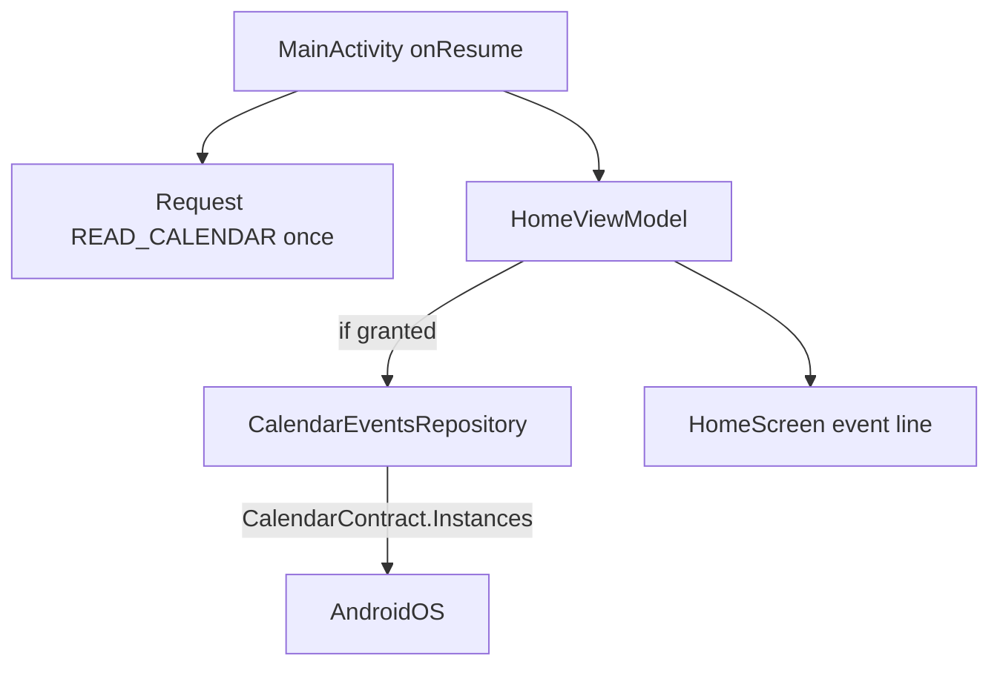

# Plan 012 — Próximo evento de calendario

**Spec:** `specs/012-next-calendar-event/spec.md`  
**Estado:** aprobado  
**Rama:** `spec/012-next-calendar-event`

## Enfoque

Leer el próximo evento vía `CalendarContract` en un **repositorio de data** (Application context). `HomeViewModel` expone un `StateFlow` opcional del evento; Home pinta una línea bajo el reloj solo si hay valor. Permiso: diálogo del SO **una vez por proceso**; sin CTA propia. Consulta en background al resume, **nunca** atada al tick 1 Hz.

## Archivos

### Crear

- `app/src/main/java/app/kvasir/launcher/domain/model/NextCalendarEvent.kt` — `title`, `beginEpochMillis`, `allDay`, `eventId` (Long opcional para intent).
- `app/src/main/java/app/kvasir/launcher/data/calendar/CalendarEventsRepository.kt` — `suspend fun nextEvent(nowMillis, horizonDays = 14): NextCalendarEvent?`; chequeo de permiso; query `CalendarContract.Instances` (begin/end window); pick evento con `end > now` y `begin` mínimo; try/catch → null. Application context only.
- `app/src/main/java/app/kvasir/launcher/domain/NextEventLineFormat.kt` (o bajo `ui/home` si se prefiere puro JVM junto a ClockFormat) — `format(event, locale): String` → `título · hora` / día completo. JVM-testeable.
- `app/src/main/java/app/kvasir/launcher/data/calendar/CalendarEventNavigator.kt` — intent VIEW / abrir calendario best-effort (sin crashear).

### Modificar

- `app/src/main/AndroidManifest.xml` — `uses-permission` `READ_CALENDAR`.
- `app/src/main/java/app/kvasir/launcher/di/AppContainer.kt` — exponer repo + navigator.
- `app/src/main/java/app/kvasir/launcher/ui/home/HomeViewModel.kt` — `nextEvent: StateFlow<NextCalendarEvent?>`; en `onResume` / refresh: si permiso → query IO; si no → `null`. `openNextEvent()`.
- `app/src/main/java/app/kvasir/launcher/MainActivity.kt` — `ActivityResultContracts.RequestPermission` una vez por proceso si `checkSelfPermission` denegado; luego `homeViewModel.onResume()` / `refreshNextEvent()`.
- `app/src/main/java/app/kvasir/launcher/ui/home/HomeScreen.kt` — bajo `HomeClock`: si `nextEvent != null`, `Text` clickable con línea formateada (`onSurfaceVariant`).
- Tests: `NextEventLineFormatTest` (o equivalente) ES/US; título vacío / all-day.

### No tocar

DataStore esquema, overlay, iconos, hábitos, reloj tipográfico (salvo vecindad layout), `WRITE_CALENDAR`, deps nuevas, Ajustes.

## Decisiones

1. **UX permiso** — silencio + pedir **una vez por proceso** en el primer resume sin permiso; sin CTA Home; sin toggle Ajustes. **Descartado:** CTA “Mostrar próximo evento”; **descartado:** solo Ajustes Kvasir (más superficie).
2. **API** — `CalendarContract.Instances` en ventana `[now, now+14d]`. **Descartado:** leer todos los Events sin Instances (recurrencias peores); **descartado:** ContentObserver permanente (complejidad/RAM).
3. **Selección** — entre instancias con `end > now`, la de **`begin` mínimo**. **Descartado:** lista de varios eventos.
4. **Empty** — `null` → no Composable de fila. **Descartado:** “Sin eventos”.
5. **Refresh** — `onResume` (+ tras resultado del permiso). **Descartado:** polling 1 Hz; **descartado:** atar a `HomeClock`.
6. **Tap** — `CalendarContract.Events.CONTENT_URI` + id o intent genérico de calendario. **Descartado:** deep-link OEM-específico obligatorio.
7. **Capas** — repo en `data/calendar`; UI solo ve modelo + string. **Descartado:** `ContentResolver` en Composable.

## Rendimiento

- Query en `Dispatchers.IO`; proyección mínima de columnas.
- Un solo objeto en StateFlow; sin cachear agenda completa.
- Reloj sigue aislado; la fila de evento es hermano bajo Home, no hijo del tick.
- Primer frame Home no espera la query.

## Persistencia / Android

- DataStore: N/A.
- Manifest: `READ_CALENDAR`.
- Runtime permission vía Activity Result API.
- Sin `WRITE_CALENDAR` / `INTERNET`.

## Dependencias

Ninguna nueva.

## Tests

| RF | Cómo |
| --- | --- |
| RF-012-01 | Checklist Manifest |
| RF-012-02 | Checklist denegar → sin fila; conceder → query |
| RF-012-03 | Unit format línea; checklist con evento real |
| RF-012-04 | Checklist sin eventos / sin permiso |
| RF-012-05 | Revisión imports UI |
| RF-012-06 | Checklist: tick no dispara query (código: refresh solo en resume) |
| RF-012-07 | Checklist tap |
| RF-012-08 | Checklist / diff Manifest sin WRITE |

Validación: `./gradlew test assembleDebug`.

## Riesgos

1. **OEM sin calendario / proveedor vacío** — Mitigación: null silencioso.
2. **Permiso denegado “Don’t ask again”** — Mitigación: no re-pedir; usuario en Ajustes del SO.
3. **Query lenta** — Mitigación: ventana 14d + IO; UI no bloquea.
4. **Título vacío** — Mitigación: fallback locale-neutral corto o omitir fila si título blank.

## Siguiente paso

Tras OK de este plan: **tareas 012** → `specs/012-next-calendar-event/tasks.md`.
