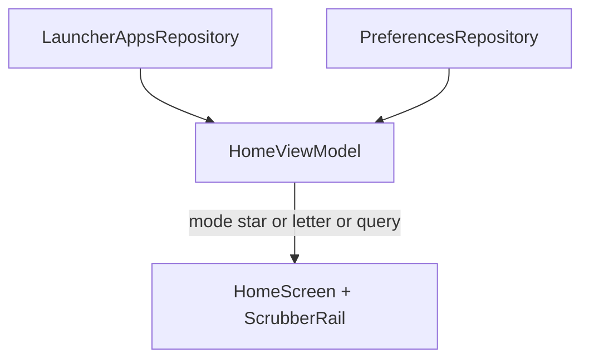

# Plan 013 — Home + scrubber unificado (Niagara)

**Spec:** `specs/013-niagara-home-scrubber/spec.md`  
**Estado:** aprobado  
**Rama:** `spec/013-niagara-home-scrubber`

## Enfoque

Absorber el listado A–Z en **Home**: un scrubber permanente **★ + A–Z + `#`**. El estado de navegación (★ vs letra, query) vive en `HomeViewModel` (o un `HomeScrubberState` combinado). Reutilizar `LetterBucket` / `AppLabelFilter`. **Retirar** `AppsOverlay` + `OverlayViewModel` como superficie de apps (swipe-up deja de abrir overlay).

## Archivos

### Crear

- `app/src/main/java/app/kvasir/launcher/ui/home/HomeScrubberRail.kt` — rail ★ + letras + `#` (tap + drag vertical); callback `onSelect(HomeListMode)`.
- Extender dominio si hace falta: p. ej. `HomeListMode` sealed (`Favorites` / `Letter(Char)`) en `domain/` o junto al VM; filtro unificado que reutilice `AppLabelFilter` / `LetterBucket`.
- Tests JVM: modo ★ vs letra vs query (puede ampliar `AppLabelFilterTest` si existe).

### Modificar

- `app/src/main/java/app/kvasir/launcher/ui/home/HomeViewModel.kt` — estado `listMode` (default ★), `searchQuery` (ya existe; ampliar semántica: query no vacía → filtrar **todas** las apps); `displayedApps` / flags para UI; `selectMode`; Back/`resetToFavorites`; quitar dependencia de overlay.
- `app/src/main/java/app/kvasir/launcher/ui/home/HomeScreen.kt` — `Row`: contenido (★ = layout actual reloj/evento/búsqueda/favoritas/hábitos; letra = cabecera + lista apps; query = lista filtrada global) + `HomeScrubberRail`. Quitar `onOpenOverlay` / swipe-up a overlay.
- `app/src/main/java/app/kvasir/launcher/domain/AppLabelFilter.kt` — API clara: favoritas+query; todas+query; todas+letra (ya en overlay filter).
- `app/src/main/java/app/kvasir/launcher/ui/KvasirRoot.kt` — dejar de montar `AppsOverlay`; Back: si no ★ o query activa → `homeViewModel.resetToFavorites()`; Settings igual.
- `app/src/main/java/app/kvasir/launcher/MainActivity.kt` — quitar `OverlayViewModel`; `onNewIntent` → `homeViewModel.resetToFavorites()` (y ya no `overlayViewModel.close()`).
- Swipe-down a panel sistema (009) se mantiene en Home.

### Eliminar o vaciar (en esta spec)

- Uso de `AppsOverlay` / `OverlayViewModel` desde Root/MainActivity. Archivos pueden borrarse si ya no tienen callers (preferible borrar para no dejar camino muerto).

### No tocar

Manifest/permisos, DataStore esquema, Ajustes alta/baja favoritas, tipografía reloj, calendario (salvo layout), deps nuevas, carpetas-grupo.

## Decisiones

1. **Estado en HomeViewModel** — un solo VM de Home con `listMode` + query. **Descartado:** mantener `OverlayViewModel` solo para letras (dos fuentes de verdad).
2. **★ default** — al arrancar y tras `onNewIntent` / Back desde letra. **Descartado:** recordar última letra en DataStore.
3. **Modo letra** — oculta reloj/hábitos/CTA (lista + búsqueda + scrubber); cabecera letra. **Descartado:** apilar letra debajo del reloj (menos Niagara, más scroll).
4. **Query** — no vacía → lista global substring; scrubber visual puede quedar pero no filtra. Al tocar letra/★ se limpia query (como 008 overlay).
5. **Overlay** — retirar. Swipe-up: **no-op** (no abre apps). Swipe-down panel (009) intacto. **Descartado:** swipe-up abre el mismo listado en modal.
6. **Scrubber visual** — rail derecho; curva “debe intentar” (offset horizontal suave por índice); si jank, rail recto. ★ como icono Material o glifo `★` Text.
7. **Iconos** — reutilizar `MonochromeAppIcon` en modo letra y búsqueda global.
8. **Favoritas** — mutación solo Ajustes (RF-013-08).

## Rendimiento

- Modo ★: no componer LazyColumn de todas las apps.
- Modo letra/query: una LazyColumn; filtrado en VM sobre snapshot en memoria.
- Reloj solo compuesto en modo ★ (aislamiento 1 Hz intacto).
- Sin segundo árbol overlay.

## Persistencia / Android

N/A DataStore. Sin Manifest nuevo.

## Dependencias

Ninguna nueva (icono ★ de Material Icons ya en Compose BOM si se usa; si no, Text `★`).

## Tests

| RF | Cómo |
| --- | --- |
| RF-013-03, 04, 06 | Unit: LetterBucket / AppLabelFilter modos |
| RF-013-01, 02, 05, 07, 08, 09 | Checklist + revisión imports / sin Overlay en Root |

Validación: `./gradlew test assembleDebug`.

## Riesgos

1. **HomeScreen crece** — Mitigación: extraer `FavoritesHomeBody` / `LetterAppsBody` composables en el mismo paquete.
2. **Conflicto swipe scrubber vs swipe panel** — Mitigación: scrubber `pointerInput` en el rail (derecha); swipe vertical global solo fuera del rail / o umbrales distintos.
3. **Regresión búsqueda Home** — Mitigación: en ★ + query, filtrar favoritas **o** todas según spec (013 dice todas); tests y checklist.

## Siguiente paso

Tras OK: **tareas 013** → `specs/013-niagara-home-scrubber/tasks.md`.
