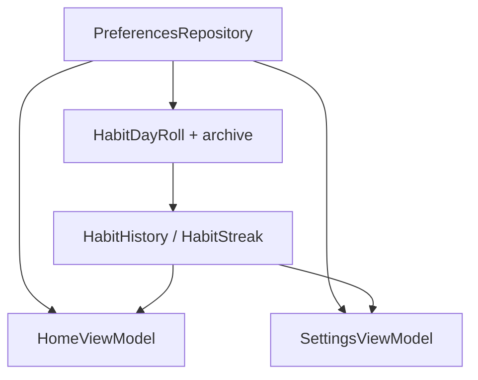

# Plan 014 — Rachas e historial de hábitos

**Spec:** `specs/014-habit-streaks/spec.md`  
**Estado:** aprobado  
**Rama:** `spec/014-habit-streaks`

## Enfoque

Añadir historial acotado en DataStore; **antes** de rolleear el day state a un nuevo `epochDay`, volcar los cumplidos del día que termina. Calcular rachas en dominio puro. Mostrar racha en Home y marcas de 7 días en Ajustes. Sin deps nuevas.

## Archivos

### Crear

- `app/src/main/java/app/kvasir/launcher/domain/model/HabitHistory.kt` — p. ej. `Map<String, Set<Long>>` (habitId → epochDays cumplidos) o type alias + helpers.
- Extender `HabitJson.kt` (o `HabitHistoryJson`) — encode/decode `habit_history_json`; corrupt → vacío.
- `app/src/main/java/app/kvasir/launcher/domain/HabitStreak.kt` — `streak(habitId, historyDays, todayCompleted, todayEpochDay): Int`; `lastSevenDays(...): List<Boolean>` (índice 0 = hace 6 días … 6 = hoy).
- `app/src/main/java/app/kvasir/launcher/domain/HabitHistoryPrune.kt` (o en el mismo archivo) — `prune(history, today, retainDays = 90)`.
- Tests: `HabitStreakTest`, encode/decode historial, prune, archive-on-roll.

### Modificar

- `PreferencesKeys.kt` — `HABIT_HISTORY_JSON` = `habit_history_json`.
- `PreferencesRepository.kt`:
  - Flow `habitHistory`.
  - `archiveDayIfNeeded` / integrar en escrituras: si day state almacenado tiene `epochDay != today`, añadir cada `completedId` → ese `epochDay` al historial, podar, persistir historial, luego escribir day state rolleado.
  - Llamar archive en `setHabitCompleted`, `removeHabit`, y un `ensureHabitDayRolled()` invocable desde `HomeViewModel.onResume` (para archivar aunque no haya toggle).
  - Al completar hoy: no hace falta duplicar en historial hasta el roll (la racha usa day state de hoy + historial).
  - `removeHabit`: borrar entrada del historial para ese id.
- `HomeViewModel` / `HomeHabitRow` — campo `streak: Int`; combine con historial.
- `HomeScreen` — sufijo sobrio si `streak >= 1` (p. ej. ` · 3`).
- `SettingsViewModel` / `SettingsScreen` — por hábito: racha y/o 7 bolitas/días (cumplido = marca).
- `strings.xml` — solo si hace falta copy (preferir número sin string larga).

### No tocar

Manifest, favoritas, scrubber 013, calendario, tema, deps Gradle, notificaciones.

## Decisiones

1. **Formato JSON** — objeto `{ "habitId": [epochDay, ...] }`. **Descartado:** un evento por fila sin índice (más pesado de consultar).
2. **Archivo al roll** — en escrituras + `ensureHabitDayRolled()` en resume. **Descartado:** solo Flow map en memoria (005 ya pierde el disco; 014 debe persistir el volcado).
3. **Racha** — si hoy cumplido, cuenta desde hoy hacia atrás; si no, desde ayer; se corta al primer hueco. **Descartado:** racha “mejor histórica” / semanal ISO.
4. **Hoy en historial** — solo entra al historial al rolleear; UI de racha mezcla historial + `completedIds` de hoy. **Descartado:** escribir historial en cada toggle (más I/O).
5. **Retención** — 90 días. **Descartado:** ilimitado.
6. **Home copy** — ` · {n}` junto al label. **Descartado:** emoji fuego (ruido visual).
7. **Ajustes 7 días** — fila de 7 indicadores (texto `●`/`○` o cajas mínimas). **Descartado:** pantalla Analytics aparte.

## Rendimiento

- Historial pequeño; decode una vez por emisión DataStore.
- Streak O(racha) por hábito; N hábitos bajo.
- Reloj aislado; no I/O en tick 1 Hz.
- `ensureHabitDayRolled` como mucho un edit/día al resume.

## Persistencia / Android

- Clave aditiva `habit_history_json`; migración default vacío.
- Sin Manifest.

## Dependencias

Ninguna nueva.

## Tests

| RF | Cómo |
| --- | --- |
| RF-014-01, 06 | HabitJson history + prune |
| RF-014-02 | test puro archive(oldDay → history) + checklist resume |
| RF-014-03 | HabitStreakTest (hoy sí/no, hueco, 0) |
| RF-014-04, 05, 07 | Checklist Home/Ajustes/borrar |
| RF-014-08 | revisión capas + Gradle |

Validación: `./gradlew test assembleDebug`.

## Riesgos

1. **Roll solo en memoria (005)** — Mitigación: `ensureHabitDayRolled` persistente.
2. **Desfase zona horaria** — Mitigación: mismo `todayEpochDay()` que 005 (`ZoneId.systemDefault()`).
3. **Historial huérfano** — Mitigación: prune al borrar hábito + poda por fecha.

## Siguiente paso

Tras OK: **tareas 014** → `specs/014-habit-streaks/tasks.md`.
