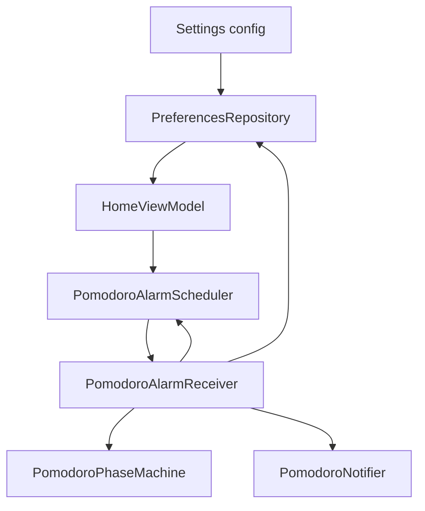

# Plan 015 — Pomodoro

**Spec:** `specs/015-pomodoro/spec.md`  
**Estado:** aprobado  
**Rama:** `spec/015-pomodoro`

## Enfoque

Timer Pomodoro con **fuente de verdad = instante de fin** (o restante si pausa), persistido en DataStore. Fin de fase vía `AlarmManager` exacto + `BroadcastReceiver` → notificación + transición de fase en dominio, reprogramación. UI Home/Ajustes solo observan ViewModel; Compose no toca alarmas ni notificaciones.

## Archivos

### Crear

- `domain/model/PomodoroConfig.kt` — `workMinutes`, `breakMinutes`, `sessionsPerCycle` + defaults 25/5/4 + `clamp()`.
- `domain/model/PomodoroSession.kt` — `status` (Idle/Running/Paused), `phase` (Work/Break), `sessionIndex` (1..N del trabajo actual), `endsAtEpochMillis?`, `remainingMillis?` (pausa).
- `domain/PomodoroJson.kt` — encode/decode config + session (`org.json`); corrupt → defaults / idle.
- `domain/PomodoroPhaseMachine.kt` — puro JVM: `start(config, now)`, `pause(session, now)`, `resume(session, now)`, `stop()`, `onAlarmFired(session, config, now)` → siguiente estado + si hay que notificar fin de fase / fin de ciclo; `remainingMillis(session, now)`.
- `domain/PomodoroRemainingFormat.kt` (o en el machine) — formateo `mm:ss` / `h:mm:ss` para UI (testeable).
- `data/pomodoro/PomodoroAlarmScheduler.kt` — `schedule(endsAt)`, `cancel()` con Application context; `AlarmManager.setExactAndAllowWhileIdle` + `PendingIntent` al receiver.
- `data/pomodoro/PomodoroNotifier.kt` — canal + notify fin trabajo/descanso/ciclo; acción Detener (PendingIntent → receiver o Activity).
- `data/pomodoro/PomodoroAlarmReceiver.kt` — al disparo: leer prefs, `onAlarmFired`, persistir, notificar, reprogramar si running.
- Tests: `PomodoroPhaseMachineTest`, `PomodoroJsonTest`, format/clamp.

### Modificar

- `PreferencesKeys.kt` — `POMODORO_CONFIG_JSON`, `POMODORO_SESSION_JSON`.
- `PreferencesRepository.kt` — flows `pomodoroConfig` / `pomodoroSession`; `updatePomodoroConfig`, `setPomodoroSession` (o API que use el scheduler/receiver).
- `AndroidManifest.xml` — `POST_NOTIFICATIONS`; `USE_EXACT_ALARM` (timer como función de producto; sideload); receiver exportado=false; opcional `RECEIVE_BOOT_COMPLETED` + receiver boot para reprogramar si sesión running (best-effort).
- `AppContainer.kt` — exponer scheduler/notifier si hace falta (o construirlos en receiver vía `KvasirApp.container`).
- `HomeViewModel` / `HomeScreen` — bloque Pomodoro aislado; tick restante solo del bloque (p. ej. `LaunchedEffect` 1s mientras running y visible, o collect de un ticker en VM **sin** invalidar reloj 011).
- `SettingsViewModel` / `SettingsScreen` — sección editar tres enteros; guardar clampeado.
- `MainActivity` — pedir `POST_NOTIFICATIONS` **al primer Iniciar** (callback desde VM/UI), no en cada `onResume` como calendario.
- `res/values/strings.xml` — copy ES (Home, Ajustes, notificaciones).
- `KvasirRoot` — cablear callbacks nuevos.

### No tocar

Hábitos/racha, favoritas, scrubber, calendario (salvo coexistir permisos), tema Compose, host App Widgets, deps Gradle, reorganización global Ajustes (016).

## Decisiones

1. **Alarma exacta** — `USE_EXACT_ALARM` + `setExactAndAllowWhileIdle`. **Descartado:** solo `WorkManager` inexacto (llega tarde). **Descartado:** FGS continuo (RAM/batería vs hiperfocus).
2. **JSON único por pieza** — `pomodoro_config_json` + `pomodoro_session_json`. **Descartado:** tres IntPreferences sueltos + session (más claves; OK también, pero un JSON alinea con hábitos).
3. **Permiso notificaciones** — al primer `Iniciar`. **Descartado:** pedir en todo `onResume` (molestia; distinto de calendario 012 donde la feature es pasiva).
4. **Tick UI** — restante derivado de `endsAt` en un composable/VM ticker local. **Descartado:** mezclar con `Clock` 1 Hz de 011.
5. **Acción Detener en notificación** — PendingIntent al mismo receiver con extra `ACTION_STOP`. **Descartado:** solo abrir Home sin acción.
6. **Boot** — `RECEIVE_BOOT_COMPLETED` reprograma si `Running`. **Descartado:** ignorar reboot (rompe RF-015-02 en práctica tras reinicio).
7. **Descanso largo** — igual que corto en v1 (spec). **Descartado:** cuarto campo ahora.

## Rendimiento

- Estado mínimo en prefs; decode al emitir DataStore.
- Reloj tipográfico intacto; Pomodoro en subárbol propio.
- Receiver trabajo corto en background; sin Bitmap.
- RSS idle &lt; 80 MB; cold/`onNewIntent` metas intactas.

## Persistencia / Android

- Claves aditivas; default config 25/5/4; session idle.
- Manifest: `POST_NOTIFICATIONS`, `USE_EXACT_ALARM`, `RECEIVE_BOOT_COMPLETED`, receiver(s).
- Runtime `POST_NOTIFICATIONS` API 33+.
- Sin `INTERNET`, sin FGS por defecto.

## Dependencias

Ninguna nueva.

## Tests

| RF | Cómo |
| --- | --- |
| RF-015-01, 02, 08 | PomodoroJson + PhaseMachine (start/pause/resume/stop/alarm chain) |
| RF-015-05 | machine `onAlarmFired` transiciones; checklist alarma real |
| RF-015-03, 04, 06 | checklist Home/Ajustes/denegar notif |
| RF-015-07, 09 | revisión capas + Gradle |

Validación: `./gradlew test assembleDebug`.

## Riesgos

1. **OEM mata alarmas** — Mitigación: exact + boot reschedule; documentar best-effort en checklist.
2. **Receiver sin proceso** — Mitigación: Application context + prefs; no Activity.
3. **Recomposición Home** — Mitigación: aislar bloque timer del reloj.
4. **Permiso exact alarm en OEM raros** — Mitigación: `USE_EXACT_ALARM`; si falla schedule, UI sigue y documentar.

## Siguiente paso

OK del recorte en `tasks.md` → implementar **una** tarea.
