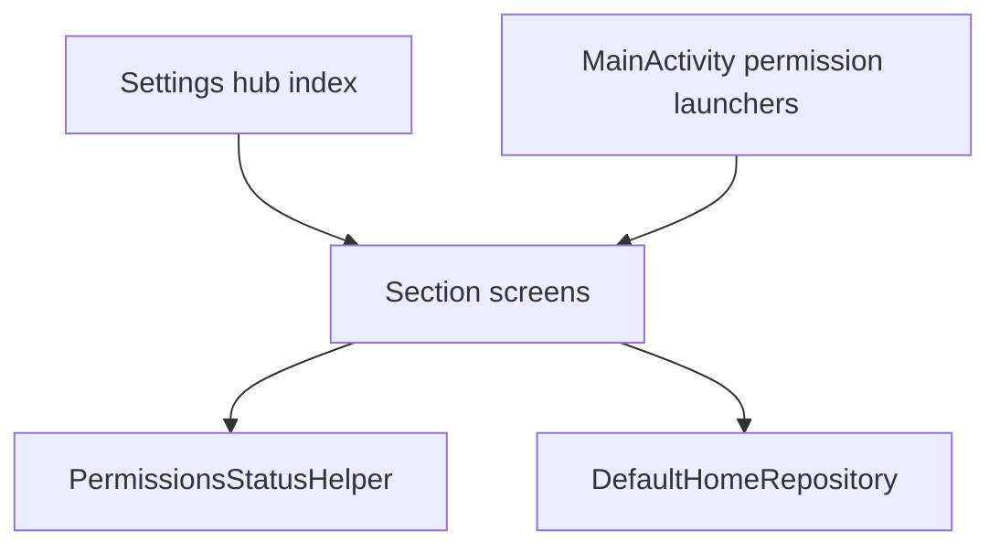

# Plan 016 — Ajustes organizados

**Spec:** `specs/016-settings-hub/spec.md`  
**Estado:** aprobado  
**Rama:** `spec/016-settings-hub`

## Enfoque

Convertir `SettingsScreen` de lista plana a **hub (índice) + secciones**. Estado de navegación efímero en Compose/VM. Sección **Permisos e Inicio** lee estado vía helper (Application context) y dispara CTAs (runtime permission / intents SO) desde Activity/ViewModel — Compose solo observa y notifica.

## Archivos

### Crear

- `domain/model/SettingsSection.kt` — enum: Appearance, Pomodoro, Favorites, Habits, Permissions.
- `data/settings/PermissionsStatusHelper.kt` (o `data/system/`) — `calendarGranted()`, `notificationsGranted()` (API 33+; else true/N/A), `exactAlarmGranted()` si API lo permite, `isDefaultHome()` delegando a `DefaultHomeRepository`; Application context.
- `data/settings/AppSettingsNavigator.kt` — intents best-effort: app details, `ACTION_APP_NOTIFICATION_SETTINGS`, exact-alarm settings (`ACTION_REQUEST_SCHEDULE_EXACT_ALARM` / app-ops según API), sin Compose.
- Tests JVM: URI/intent builders puros si aplica (mismo patrón `AppDetailsNavigator.packageDetailsUriString`).

### Modificar

- `SettingsViewModel` — `SettingsSection?` (null = hub); `openSection` / `backToHub`; `permissionsUi` StateFlow refrescado en `onSettingsOpened` / `onResume` de Ajustes; acciones `requestCalendar`, `requestNotifications`, `openHomePicker`, `openAppDetails`, `openNotificationSettings`, `openExactAlarmSettings` (emit events para Activity o startActivity vía Application).
- `SettingsScreen.kt` — partir en hub + pantallas de sección (composables privados o archivos `SettingsAppearanceSection`, etc.); reutilizar filas actuales de tema / Pomodoro / favoritas / hábitos.
- `KvasirRoot` — Back: si hay sección abierta → hub; si hub → Home (ajustar `BackHandler`).
- `MainActivity` — reutilizar / extender launchers de permiso para CTAs del hub (calendario + notificaciones); refrescar estado al volver de ajustes SO (`onResume` → `settingsViewModel.refreshPermissions()` cuando destination Settings).
- `strings.xml` — copy ES del índice, subtítulos, estados y CTAs.
- `DefaultHomeRepository` — sin cambio de contrato si basta; hub lo reutiliza.

### No tocar

Home layout, Pomodoro dominio/alarma, hábitos DataStore, Manifest permisos nuevos, deps Gradle, scrubber.

## Decisiones

1. **Navegación** — enum + `rememberSaveable` / StateFlow en VM (sobrevive rotación). **Descartado:** NavHost/Compose Navigation (deps o boilerplate sin ganancia).
2. **Permisos refresh** — al abrir hub/sección Permisos y en `onResume` de Activity si Ajustes visible. **Descartado:** polling.
3. **CTA denegado** — primero runtime request si aún no se preguntó / puede pedir; si denegado permanente → abrir detalles de la app. **Descartado:** solo texto sin acción.
4. **Alarmas exactas** — fila si `AlarmManager.canScheduleExactAlarms` existe; si no, omitir. **Descartado:** siempre mostrar fila confusa en API viejas.
5. **Favoritas en sección** — misma lista larga que hoy; no paginar. **Descartado:** búsqueda en favoritas (fuera de alcance).

## Rendimiento

- Sin impacto Home chrome.
- Helper de permisos: checks baratos; sin Bitmap.
- Secciones no montadas hasta abrirse (cuando destination = sección).

## Persistencia / Android

- DataStore: N/A.
- Manifest: sin permisos nuevos; intents de Settings ya usados o equivalentes.
- Runtime: mismos `READ_CALENDAR` / `POST_NOTIFICATIONS`.

## Dependencias

Ninguna nueva.

## Tests

| RF | Cómo |
| --- | --- |
| RF-016-01…03 | Checklist navegación + config intacta |
| RF-016-04 | helper + checklist CTAs |
| RF-016-05…07 | revisión capas / prefs / Gradle |

Validación: `./gradlew test assembleDebug`.

## Riesgos

1. **OEM sin intent de notificaciones** — Mitigación: fallback a `APPLICATION_DETAILS_SETTINGS`.
2. **Back stack confuso** — Mitigación: un solo nivel hub↔sección; BackHandler explícito.
3. **Estado permisos stale** — Mitigación: refresh onResume.

## Siguiente paso

OK del recorte en `tasks.md` → implementar **una** tarea.
