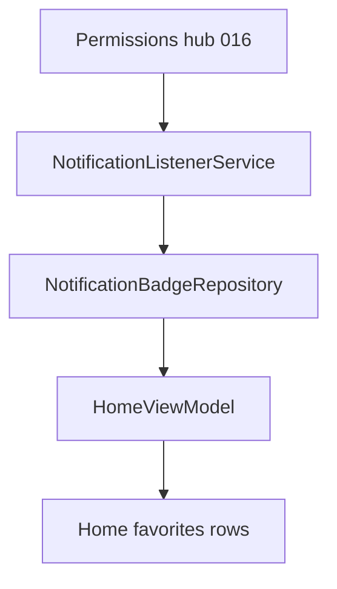

# Plan 017 — Badges de notificación

**Spec:** `specs/017-badges/spec.md`  
**Estado:** aprobado  
**Rama:** `spec/017-badges`

## Enfoque

`NotificationListenerService` mantiene en memoria un `StateFlow`/`SharedFlow` de **package names** con notificación activa. Home combina ese set con favoritas y pinta un `•` junto al label. Ajustes → Permisos e Inicio muestra si el listener está habilitado y abre `ACTION_NOTIFICATION_LISTENER_SETTINGS`. Compose no toca el servicio.

## Archivos

### Crear

- `data/notifications/NotificationBadgeRepository.kt` — Application-scoped holder: `badgedPackages: StateFlow<Set<String>>`, `replaceFromActiveList`, `onNotificationPosted(packageName)`, `onNotificationRemoved` (recompute or remove if none left); `isListenerEnabled(context)`.
- `data/notifications/KvasirNotificationListenerService.kt` — `onListenerConnected` / `onNotificationPosted` / `onNotificationRemoved` / `onListenerDisconnected` → actualiza el repo vía `KvasirApp.container` (sin Activity).
- `domain/NotificationBadgeOps.kt` (opcional, JVM) — helpers puros: merge posted/removed given active list snapshots.
- Test: `NotificationBadgeOpsTest` (o test del merge de sets).

### Modificar

- `AndroidManifest.xml` — service + `BIND_NOTIFICATION_LISTENER_SERVICE` + intent-filter `NotificationListenerService`.
- `AppContainer.kt` — exponer `NotificationBadgeRepository`.
- `PermissionsStatus` + `PermissionsStatusHelper` — campo `notificationListenerGranted` (o nombre claro distinto de `POST_NOTIFICATIONS`).
- `AppSettingsNavigator` — `notificationListenerSettingsIntent()` / `openNotificationListenerSettings`.
- `SettingsScreen` / `SettingsViewModel` — fila en Permisos e Inicio + CTA.
- `HomeViewModel` — combine/expose `Set<String>` badged packages (o `hasBadge` por fila).
- `HomeScreen` `AppRow` / favoritas — si `app.packageName in badged` y chrome ★, sufijo ` •` (no en `CatalogHomeBody`).
- `strings.xml` — copy hub listener.

### No tocar

Pomodoro, hábitos DataStore, scrubber badges, números, deps Gradle, DataStore de contenido de notifs.

## Decisiones

1. **Agregación** — set de `packageName` (no componentKey): una notif de la app marca todas las activities favoritas de ese paquete. **Descartado:** badge por activity (el listener da package).
2. **Posted/Removed** — en `onListenerConnected` y tras removed, re-scan `activeNotifications` filtrando packages (fuente de verdad). **Descartado:** solo incrementar/decrementar contadores (fácil de desincronizar).
3. **Filtro** — incluir notificaciones no-ongoing por defecto; excluir `isOngoing` / group summaries vacíos si ensucian (ajustar en implementación con comentario RF). **Descartado:** mostrar todo sin filtro (media/session permanentes).
4. **UI** — sufijo ` •` al label de favorita. **Descartado:** badge sobre icono Bitmap.
5. **Listener vs POST_NOTIFICATIONS** — filas separadas en hub (016 ya tiene “Notificaciones” = post; nueva = “Acceso a notificaciones” / listener).

## Rendimiento

- Set pequeño; update solo en callbacks del listener.
- Home: invalidar solo lista de favoritas al cambiar el set.
- Reloj 011 intacto.
- Sin Bitmap / sin deps.

## Persistencia / Android

- DataStore: N/A.
- Manifest: `NotificationListenerService` + permission bind.
- Intent: `Settings.ACTION_NOTIFICATION_LISTENER_SETTINGS`.

## Dependencias

Ninguna nueva.

## Tests

| RF | Cómo |
| --- | --- |
| RF-017-01 | merge/recompute set (JVM) |
| RF-017-02…05 | checklist dispositivo |
| RF-017-06…08 | capas / prefs / Gradle |

Validación: `./gradlew test assembleDebug`.

## Riesgos

1. **Usuario no habilita listener** — Mitigación: silencio + CTA en hub 016.
2. **OEM mata el servicio** — Mitigación: reconnect + rescan en `onListenerConnected`; documentar best-effort.
3. **Confusión POST_NOTIFICATIONS vs listener** — Mitigación: copy distinto en hub.

## Siguiente paso

OK del recorte en `tasks.md` → implementar **una** tarea.
