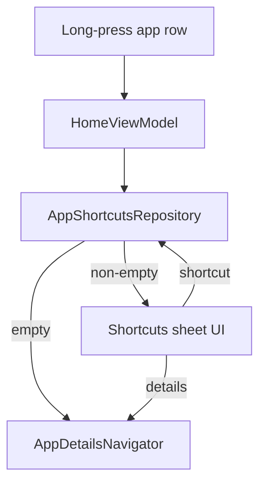

# Plan 018 — Atajos de apps

**Spec:** `specs/018-shortcuts/spec.md`  
**Estado:** aprobado  
**Rama:** `spec/018-shortcuts`

## Enfoque

En long-press de una app, el ViewModel pide atajos al repo (`LauncherApps.getShortcuts`). Si la lista está vacía → `AppDetailsNavigator` (009). Si no → estado UI de sheet con ≤5 labels + “Detalles”; tap llama `startShortcut`. Compose solo observa y notifica.

## Archivos

### Crear

- `domain/model/AppShortcut.kt` — `id`, `packageName`, `shortLabel` (String); sin Drawable.
- `domain/AppShortcutMapper.kt` (o en data) — `ShortcutInfo` → `AppShortcut`; `take(MAX = 5)`; corrupt/empty label skip. Parte testeable con un DTO puro si `ShortcutInfo` no es JVM-friendly.
- `data/apps/AppShortcutsRepository.kt` — `suspend fun shortcutsFor(packageName): List<AppShortcut>`; `fun startShortcut(shortcut)`; Application context + `Process.myUserHandle()`; flags `FLAG_MATCH_MANIFEST or FLAG_MATCH_DYNAMIC` (y `FLAG_MATCH_PINNED` opcional solo para listar si ya existen, **sin** pin UI en Home).
- Tests: tope 5 / filtro labels vacíos (puro).

### Modificar

- `HomeViewModel` — `onAppLongClick(app)`: cargar atajos; si vacíos → `openAppDetails`; si no → emitir `ShortcutsSheetState(app, shortcuts)`. `launchShortcut` / `dismissShortcutsSheet` / `openDetailsFromSheet`.
- `HomeScreen` / `KvasirRoot` — sheet Compose (AlertDialog o ModalBottomSheet Material3 ya en deps) con filas texto; no LauncherApps.
- `strings.xml` — `Detalles de la app`.
- Cablear long-press favoritas + catálogo al nuevo flujo (hoy van directo a details).

### No tocar

Favoritas DataStore, badges listener, Pomodoro, Manifest permisos, work profile, pins en lista ★, iconos Bitmap de shortcuts.

## Decisiones

1. **Query flags** — `MANIFEST | DYNAMIC` (+ pinned en query si el SO los mezcla, sin UI de pin). **Descartado:** solo pinned.
2. **Sheet** — `ModalBottomSheet` o diálogo simple Material3 existente. **Descartado:** Activity nueva.
3. **Carga** — on demand en long-press en `Dispatchers.Default`. **Descartado:** precache de todos los packages (RAM).
4. **0 atajos** — details directo (009). **Descartado:** sheet vacío.
5. **Label** — `shortLabel` / `longLabel` fallback a string no vacío. **Descartado:** iconos de shortcut.

## Rendimiento

- Una query por long-press; lista ≤5.
- Sin Bitmap; sheet efímero.
- Reloj 011 intacto.

## Persistencia / Android

- DataStore: N/A.
- Manifest: sin permisos nuevos.
- APIs `LauncherApps` shortcuts (API 25+; minSdk 26 OK).

## Dependencias

Ninguna nueva.

## Tests

| RF | Cómo |
| --- | --- |
| RF-018-01, 03 | mapper + take(5) JVM |
| RF-018-02, 04–07 | checklist + capas / Gradle |

Validación: `./gradlew test assembleDebug`.

## Riesgos

1. **OEM sin shortcuts** — Mitigación: fallback details.
2. **startShortcut SecurityException** — Mitigación: try/catch + log.
3. **Confusión con long-press = solo details** — Mitigación: fila Detalles siempre en el sheet.

## Siguiente paso

OK del recorte en `tasks.md` → implementar **una** tarea.
