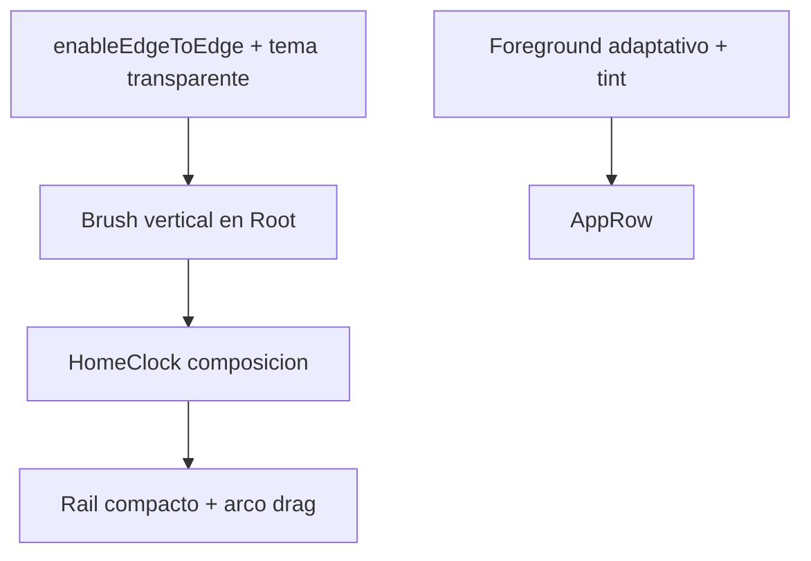

# Plan 019 — Pulido visual de Home

**Spec:** `specs/019-home-visual-polish/spec.md`  
**Estado:** aprobado  
**Rama:** `spec/019-home-visual-polish`

## Enfoque

Pulido solo de **ventana + Compose**. Sin DataStore. Iconos: extraer **foreground** de `AdaptiveIconDrawable` (y máscara por alfa/luminancia) antes del tinte, para no pintar el disco de fondo. Reloj: reordenar `HomeClock` y acortar formatos. Scrubber: rail con altura intrínseca, offset en X tipo seno **amplificado durante drag**, burbuja de selección.

## Archivos

### Modificar

- `app/src/main/res/values/themes.xml` — status/nav transparentes; `windowLightStatusBar` coherente.
- `MainActivity.kt` — `enableEdgeToEdge()`; system bars según tema Compose.
- `ui/theme/Theme.kt` — colores de fondo para degradado (oscuro/claro).
- `ui/KvasirRoot.kt` — fondo degradado detrás de Home y Ajustes; Surface transparente.
- `ui/home/HomeScreen.kt` — insets; `OutlinedTextField` / `Checkbox` con `RoundedCornerShape`; evento sale del cuerpo plano y entra en el bloque reloj.
- `ui/home/HomeClock.kt` — layout Niagara-like (día centro; hora izq; fecha der); recibe línea de evento opcional.
- `ui/home/ClockFormat.kt` — hora `FormatStyle.SHORT`; fecha `MMM d` + uppercase.
- `ui/home/HomeScrubberRail.kt` — compacto, drag state, arco fuerte, burbuja.
- `data/apps/AppIconLoader.kt` / `ui/icons/MonochromeAppIcon.kt` — silueta (foreground adaptativo).
- `app/src/test/.../ClockFormatTest.kt` — SHORT / fecha `SEP 8` (US).
- `specs/README.md` — 019 en hechas al cerrar (en el PR de la spec).

### No tocar

DataStore, Manifest permisos/HOME, Pomodoro, badges listener, atajos, FavoritesResolver.

## Decisiones

1. **Status bar** — `enableEdgeToEdge()` + `statusBarColor/navigationBarColor` transparentes. **Descartado:** pintar un `Box` gris bajo el inset (es el bug actual: tema XML Light + no edge-to-edge).
2. **Iconos** — si `AdaptiveIconDrawable`, dibujar solo `foreground` a tamaño acotado y tint `SrcIn`; resto: drawable tal cual + tint (muchos ya tienen alfa). **Descartado:** `SrcIn` sobre badged icon completo (produce el círculo blanco). **Descartado:** Coil.
3. **Buscador** — `OutlinedTextField` + `shape = CircleShape` o `RoundedCornerShape(50)`. **Descartado:** quitar el campo (el usuario lo quiere, redondo).
4. **Checkbox** — `CheckboxDefaults` + clip circular / `RoundedCornerShape(6.dp)` mínimo; preferir indicador redondo. **Descartado:** checkbox Material cuadrado por defecto.
5. **Scrubber** — `Column` con altura wrap + `Arrangement.spacedBy` pequeño, centrada verticalmente; no `weight(1f)` por letra. Drag: `isDragging` → amplitud de seno ~48–72 px + círculo detrás del glifo activo. **Descartado:** `fillMaxHeight` + weight (separa ★ y letras).
6. **Degradado** — `Brush.verticalGradient` 2–3 stops del `colorScheme` (surface oscuro → black). **Descartado:** wallpaper / bitmap.
7. **Reloj** — `Box` centrado: `TUE` display; `Row` overlay o `BoxWithConstraints` con hora start / fecha end alineadas al centro vertical del día; evento `Text` debajo. Hora SHORT. **Descartado:** copiar `.ttf` Niagara. **Descartado:** `FormatStyle.MEDIUM` (trae segundos).
8. **Evento** — se mueve al bloque reloj (sigue 012: tap abre evento; formato existente, opcional uppercase visual). **Descartado:** duplicar la línea bajo el reloj y otra vez en la lista.

## Rendimiento

- Reloj: estado `Instant` local; evento es string ya formateado (no tick).
- Iconos: mismo LRU 48; decode ≤ ~28 dp.
- Scrubber: `isDragging` + índice; lista de apps no se recompone por pixel.
- Degradado: un `drawBehind` / `background(Brush)` en root.

## Persistencia / Android

N/A DataStore. Manifest: N/A (solo tema ventana).

## Dependencias

Ninguna.

## Tests

| RF | Cómo |
| --- | --- |
| RF-019-06 | JVM `ClockFormat` SHORT y fecha uppercase sin año |
| resto | checklist dispositivo + `./gradlew test assembleDebug` |

## Riesgos

1. **OEM status bar** — Mitigación: `WindowCompat` + `SystemBarStyle`.
2. **Iconos no adaptativos** — Mitigación: tint del drawable original; hueco si null.
3. **Arco a 60 fps** — Mitigación: offsets en rail; no animar la LazyColumn.
4. **Copyright Niagara** — Mitigación: layout + Material fonts; cero assets ajenos.
