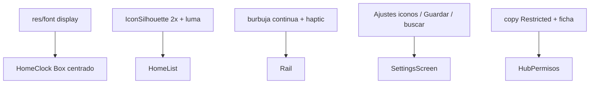

# Plan 020 — Pulido Home/Ajustes + acceso a notificaciones

**Spec:** `specs/020-settings-home-polish/spec.md`  
**Estado:** aprobado  
**Rama:** `spec/020-settings-home-polish`

## Enfoque

Una spec de pulido de UI + copy de un límite del SO. Sin backend. Iconos: máscara a alta densidad. Scrubber: `animatable`/offset en Y de la burbuja + `HapticFeedback` al cambiar índice. Ajustes: drafts Pomodoro, filtro Favoritas, iconos hábitos.

## Archivos

### Crear

- `app/src/main/res/font/` — display del día (Anurati u OFL) + `res/values/font_certs` no aplica.
- `app/src/main/res/drawable/ic_settings.xml`, `ic_arrow_back.xml`, `ic_add.xml`, `ic_delete.xml` — vectores 24 dp.
- Tests JVM de máscara luminancia si se extrae a `IconSilhouetteOps`.

### Modificar

- `HomeClock.kt` — `Box` + día centrado; `FontFamily` solo en weekday.
- `HomeScreen.kt` — IconButton Ajustes.
- `HomeScrubberRail.kt` — burbuja `offset` continuo; haptic on index change.
- `IconSilhouette.kt` / `IconSilhouetteOps.kt` — raster 2–3×; luma→alpha.
- `SettingsScreen.kt` — atrás flecha; Pomodoro Guardar; búsqueda Favoritas; hábitos iconos.
- `strings.xml` — Guardar cambios; copy restricted; contentDescriptions.
- `AndroidManifest.xml` — `VIBRATE` solo si hace falta.
- `AppSettingsNavigator` — ya abre ficha; hub usa ambos CTAs.
- `docs/device-checklist.md` — paso restricted settings (opcional, si se toca docs 007).

### No tocar

DataStore esquema, HOME intent-filter, Pomodoro alarmas, listener service (solo copy/CTA).

## Decisiones

1. **Anurati** — empaquetar OTF en `res/font` + crédito a Emmeran Richard (uso personal, no comercial). **Descartado:** Anurati Pro de pago. **Descartado:** copiar Niagara.
2. **Centrar** — `Box(fillMaxWidth) { Text día center; Row hora/fecha fillMaxWidth spaceBetween }` con el día **sin** weight, centrado absoluto. **Descartado:** seguir con tres `weight(1f)` (desplaza TUE).
3. **Iconos UI** — XML drawable. **Descartado:** `material-icons-extended` (dep).
4. **Silueta** — dibujar a `sizePx * 3`, crop, luma→alpha, scale down con filtro. **Descartado:** SrcIn a 28 dp del PNG de color.
5. **Háptica** — `Modifier.haptic / view.performHapticFeedback(KEYBOARD_TAP)` primero (sin permiso). Si insuficiente: `Vibrator` + `VIBRATE`.
6. **Burbuja** — `dragY` normalizado → índice **y** offset pixel de la burbuja (overlay), letras fijas. **Descartado:** saltar la burbuja de celda en celda.
7. **Pomodoro** — un `Guardar` llama los tres setters del VM. **Descartado:** auto-save on each keystroke.
8. **Restricted** — no hay API para «Allow restricted settings»; copy + `openAppDetails`. **Descartado:** root/adb desde la app.

## Rendimiento

- Fuente: Typeface cache del framework, un Text.
- Iconos: un Bitmap extra temporal 3× por carga, no se guarda a 3× en LRU (sigue Drawable LRU).
- Scrubber: estado float local; no invalidar LazyColumn.

## Persistencia / Android

Pomodoro: mismas keys. Manifest: `VIBRATE` opcional. Intents existentes.

## Dependencias

Ninguna. Un archivo de fuente.

## Tests

| RF | Cómo |
| --- | --- |
| RF-020-04 | JVM luma/alpha si hay ops |
| RF-020-08 | AppLabelFilter existente o test del filtro de sección |
| resto | checklist + `./gradlew test assembleDebug` |

## Riesgos

1. **Licencia Anurati (uso personal)** — Mitigación: crédito al autor; no vender el launcher.
2. **Restricted settings no desaparece** — Mitigación: copy; no fingir concedido.
3. **Háptica molesta** — Mitigación: solo al **cambio de índice**, no por pixel.
4. **Iconos aún feas en OEM** — Mitigación: foreground adaptativo + luma; hueco si falla.
