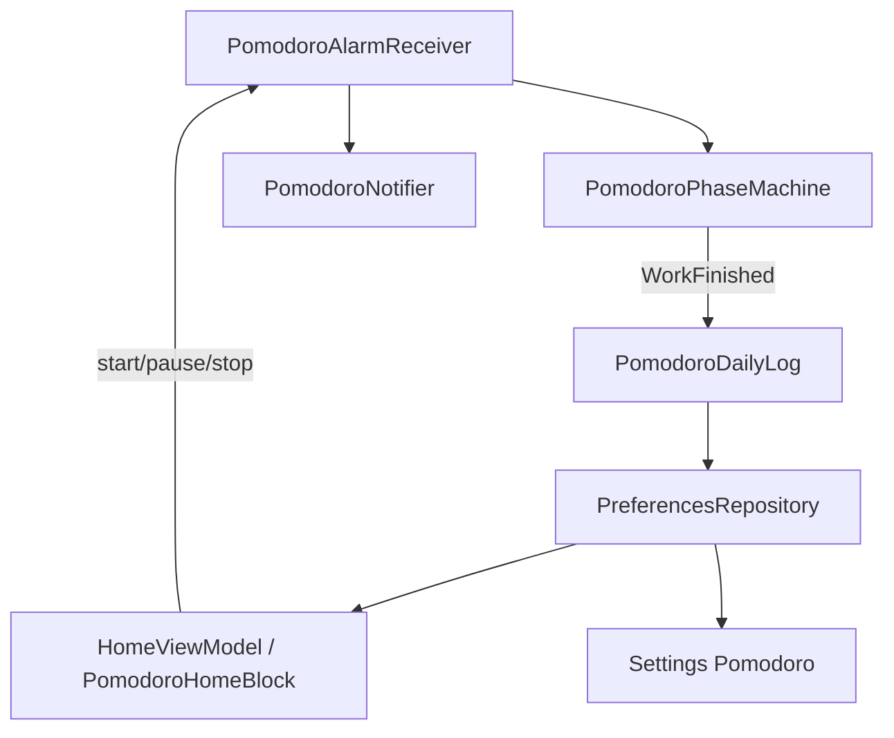

# Plan 021 — Pomodoro: registro diario, bloque visible y pantalla de bloqueo

**Spec:** `specs/021-pomodoro-focus-log/spec.md`  
**Estado:** aprobado  
**Rama:** `spec/021-pomodoro-focus-log`

## Enfoque

Extender el Pomodoro **015** sin reescribir la máquina de fases: al completar un **trabajo**, incrementar un mapa día→conteo (retención 30 días). Home muestra el bloque más visible + `Hoy · N`. Ajustes aclara «Sesiones por ciclo» y lista historial. Avisos de fin de fase afinan copy (trabajo→descanso). Mientras running/paused, una **notificación ongoing** distinta (chronometer hacia `endsAt`) visible en bloqueo; alarma exacta 015 sigue siendo la fuente de verdad del fin de fase.

## Archivos

### Crear

- `domain/PomodoroDailyLog.kt` — ops puras: `incrementToday(map, dayKey)`, `prune(map, today, retainDays=30)`, `todayCount(map, dayKey)`, `sortedEntries(map)`.
- `domain/PomodoroDailyJson.kt` **o** extensión de `PomodoroJson.kt` — encode/decode `Map<String, Int>` (`yyyy-MM-dd` → count); corrupt → vacío.
- Tests JVM: `PomodoroDailyLogTest` (+ JSON si archivo aparte).

### Modificar

- `PreferencesKeys.kt` — `POMODORO_DAILY_JSON` (string).
- `PreferencesRepository.kt` — flow `pomodoroDaily`; `incrementPomodoroWorkCompleted(dayKey)` (lee→increment→prune→write); expose map/list for Settings/Home.
- `data/pomodoro/PomodoroController.kt` — tras `onAlarmFired` / transición con `WorkFinished`, llamar incremento diario; tras start/pause/resume/stop y tras alarma, sincronizar notificación **ongoing** (mostrar/actualizar/cancelar).
- `data/pomodoro/PomodoroNotifier.kt` —  
  - evento `WorkFinished`: título/cuerpo «Trabajo terminado» / «Empieza el descanso»;  
  - IDs separados: alerta de fase (autoCancel) vs **ongoing** (`setOngoing(true)`, `setOnlyAlertOnce(true)`, chronometer countdown si Running, texto estático si Paused);  
  - acciones Pause/Resume/Stop en ongoing; `cancelOngoing()` en idle/stop.
- `data/pomodoro/PomodoroAlarmReceiver.kt` — acciones `ACTION_PAUSE` / `ACTION_RESUME` (además de STOP/ALARM/BOOT); delegar al controller.
- `ui/home/HomeViewModel.kt` (+ estado UI) — exponer `pomodoroTodayCount`.
- `ui/home/HomeScreen.kt` — `PomodoroHomeBlock`: `Surface`/contenedor propio, tipografía de restante mayor, línea `Hoy · N`; tick 1 Hz **solo** dentro del bloque (como hoy).
- `ui/settings/SettingsViewModel.kt` / `SettingsScreen.kt` — ayuda bajo «Sesiones por ciclo»; lista historial (fecha formateada ES + conteo).
- `res/values/strings.xml` — copy RF-021 (Hoy, historial, ayuda ciclo, notify cuerpo descanso, Pausar/Reanudar en notif si faltan).
- `AndroidManifest.xml` — **solo si** el plan de implementación detecta que hace falta FGS (ver decisión 3); default = sin cambio de permisos nuevos.

### No tocar

Scrubber, favoritas, hábitos, badges, listener 017, tema global, deps Gradle, `sessionsPerCycle` semántica (solo copy), reloj 011.

## Decisiones

1. **Historial JSON mapa** — una clave `pomodoro_daily_json`. **Descartado:** Room/SQLite (deps/peso). **Descartado:** un Int solo «hoy» sin historial (no cumple RF-021-04).
2. **Incremento en data al `WorkFinished`** — `PomodoroController` tras la transición de dominio. **Descartado:** incrementar en Compose (rompe capas). **Descartado:** cambiar `PhaseMachine` para devolver el mapa (mezcla persistencia).
3. **Ongoing sin FGS (default)** — notificación ongoing + `setUsesChronometer` / `setChronometerCountDown` anclado a `endsAtEpochMillis`; alarma 015 sigue cerrando la fase. **Descartado:** FGS continuo tick 1 Hz (015 lo rechazó; batería/RAM). Si en checklist un OEM mata el ongoing sin FGS, **escalar en la misma spec** con `FOREGROUND_SERVICE` + tipo `specialUse`/`dataSync` acotado — no inventar en v1 sin evidencia.
4. **Dos notification IDs** — alerta de evento vs ongoing. **Descartado:** un solo ID (el fin de fase cancelaría el chronometer o viceversa).
5. **Bloque Home = Surface local** — `MaterialTheme` surfaceVariant / outline, padding y `titleLarge`/`headlineSmall` en restante. **Descartado:** Card con elevación agresiva / widgets ajenos.
6. **Fecha de día** — `yyyy-MM-dd` en zona local del dispositivo (mismo espíritu que hábitos). **Descartado:** epoch UTC day (rompe «Hoy» al usuario).
7. **Historial UI** — LazyColumn/filas bajo el formulario Pomodoro en Ajustes (misma sección). **Descartado:** pantalla nueva / gráfica.

## Rendimiento

- Mapa ≤30 entradas; decode barato en DataStore emit.
- `Hoy · N` solo recomponen cuando cambia el flow diario o el bloque timer (aislado).
- Chronometer del framework actualiza la sombra **sin** recomponer Home.
- RSS idle &lt; 80 MB; cold/`onNewIntent` metas intactas.

## Persistencia / Android

- Clave aditiva; ausencia → `{}`; poda a 30 días en cada write de incremento.
- Config/sesión 015 intactas.
- Manifest: sin cambio previsto; FGS solo si se dispara la escalada de decisión 3.
- Reutilizar `POST_NOTIFICATIONS` + canal `pomodoro`.

## Dependencias

Ninguna nueva.

## Tests

| RF | Cómo |
| --- | --- |
| RF-021-02, 03 | `PomodoroDailyLogTest` (+ JSON): increment, prune 30, Detener no aplica (controller/checklist) |
| RF-021-01, 04, 05, 06, 07, 08 | checklist dispositivo |
| RF-021-09, 10 | capas + diff Gradle |

Validación por tarea: `./gradlew test assembleDebug` + checklist del RF tocado.

## Riesgos

1. **OEM oculta ongoing en bloqueo** — Mitigación: canal importancia adecuada; documentar en checklist; FGS solo si falla de forma sistemática.
2. **Doble conteo si alarma se reentrega** — Mitigación: incrementar solo en el camino `onAlarmFired` de trabajo→break una vez por transición persistida (mismo patrón idempotente que la máquina).
3. **Cambio de medianoche con sesión running** — Mitigación: el incremento usa el día de `now` al completar; «Hoy» en Home lee el dayKey actual (el trabajo que cruza medianoche cuenta en el día en que termina).
4. **Recomposición Home** — Mitigación: no meter tick de notificación en Compose; Surface solo envuelve el bloque existente.
